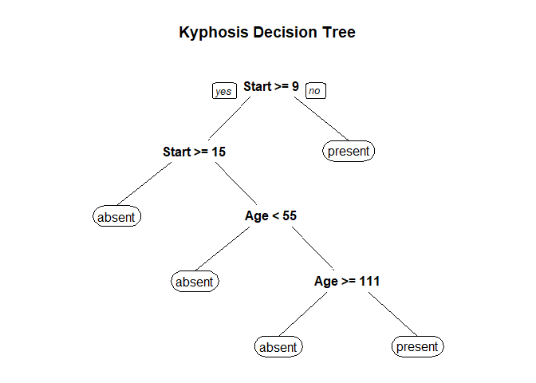

Insert Title
================
Author: Holiday Tang  
[LinkeDin](https://www.linkedin.com/in/holiday-t/) |
[GitHub](https://github.com/holiday007) | [Kaggle
Novice](https://www.kaggle.com/holibae007)
| Date: 2019-12-30

  - [Introduction to tree methods](#introduction-to-tree-methods)
  - [Random forest](#random-forest)
      - [Data](#data)
      - [Tree Model](#tree-model)
      - [Random Forest Model](#random-forest-model)

(Note: adopted from Udemy course, *Data sicence and machine learning
bootcamp with R* by Jose Portilla)

# Introduction to tree methods

**Elements of a decision tree:** (Recursive Partitioning & Regression
Trees)

  - Nodes: split for the value of certain attribute
  - Edges: outcome of a split to the next node


“Hungry?” is a nodes, “Yes” is an edge. Also, what is a terminal node?

**How to mathematically choose the best splits?**

  - Entropy:

  - Information Gain:

(Intuition: Choose features that best split data)

# Random forest

**Motivation**:

To improve performance, use many trees with a random sample of features
chosen for splitting.

**What is it ?**

  - A new random sample of features is chosen for every single tree at
    every single split
      - create an ensemble of decision trees using *bootstrap samples*
        of the training set (aka, sampling from the training set with
        replacement)
  - For classification, 
    (\# of chosen features) is typically chosen to be the square root of
     (total \# of
    features )

[what is bagging and
boosting?](https://towardsdatascience.com/decision-tree-ensembles-bagging-and-boosting-266a8ba60fd9)

**What is the point?**

  - Suppose there is **one very strong feature** in the data set. When
    use “bagged trees”, most of the trees will use that feature as the
    top split, resulting in an ensemble of smililar trees that are
    highly correlated (which is undesirable). The problem is, averaging
    highly correlated quantities does not significantly reduce variance.

  - By randomly leaving out candidate features for each split, Random
    Forest **decorrelates** the trees, such that the averaging process
    can reduce the variance of the resulting model.

<!-- end list -->

``` r
library(rpart) # for decision trees
```

#### Data

``` r
# data (https://www.kaggle.com/abbasit/kyphosis-dataset)
Kyphosis = read.csv("kyphosis.csv")
str(Kyphosis)
```

    'data.frame':   81 obs. of  4 variables:
     $ Kyphosis: Factor w/ 2 levels "absent","present": 1 1 2 1 1 1 1 1 1 2 ...
     $ Age     : int  71 158 128 2 1 1 61 37 113 59 ...
     $ Number  : int  3 3 4 5 4 2 2 3 2 6 ...
     $ Start   : int  5 14 5 1 15 16 17 16 16 12 ...

``` r
head(Kyphosis)
```

``` 
  Kyphosis Age Number Start
1   absent  71      3     5
2   absent 158      3    14
3  present 128      4     5
4   absent   2      5     1
5   absent   1      4    15
6   absent   1      2    16
```

#### Tree Model

``` r
# method = "class" - classification
tree = rpart(Kyphosis ~., method = "class", data = Kyphosis)
```

**Examing Results of the Tree Model**

  - `printcp(fit)`: display cp table
  - `plotcp(fit)`: plot cross-validation results
  - `rsq.rpart`: plot approx R-squared and relative error for different
    splits (2 plots). labels are only appropriate for the “anova” method
  - `print(fit)`: print results
  - `summary(fit)`: detailed results including surrogate splits
  - `plot(fit)`: plot decision tree
  - `text(fit)`: label the decision tree plot
  - `post(fit, file =)`: create postscript plot of decision tree

<!-- end list -->

``` r
printcp(tree)
```

``` 

Classification tree:
rpart(formula = Kyphosis ~ ., data = Kyphosis, method = "class")

Variables actually used in tree construction:
[1] Age   Start

Root node error: 17/81 = 0.20988

n= 81 

        CP nsplit rel error xerror    xstd
1 0.176471      0   1.00000 1.0000 0.21559
2 0.019608      1   0.82353 1.0588 0.22010
3 0.010000      4   0.76471 1.0588 0.22010
```

``` r
library(rpart.plot)
prp(tree, main = "Kyphosis Decision Tree")
```

<!-- -->

#### Random Forest Model

``` r
library(randomForest)

rf.model = randomForest(Kyphosis ~., ntree = 500, data = Kyphosis)

rf.model
```

``` 

Call:
 randomForest(formula = Kyphosis ~ ., data = Kyphosis, ntree = 500) 
               Type of random forest: classification
                     Number of trees: 500
No. of variables tried at each split: 1

        OOB estimate of  error rate: 19.75%
Confusion matrix:
        absent present class.error
absent      60       4   0.0625000
present     12       5   0.7058824
```

``` r
# confusion matrix
rf.model$confusion
```

``` 
        absent present class.error
absent      60       4   0.0625000
present     12       5   0.7058824
```

``` r
importance(rf.model)
```

``` 
       MeanDecreaseGini
Age            8.641544
Number         5.468288
Start         10.042689
```
