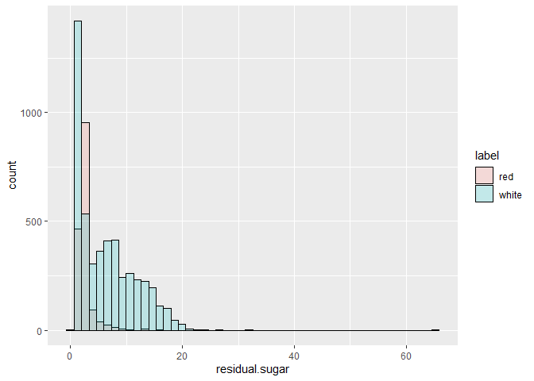
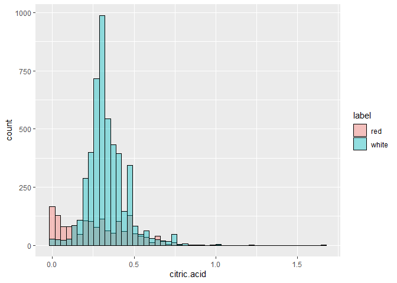
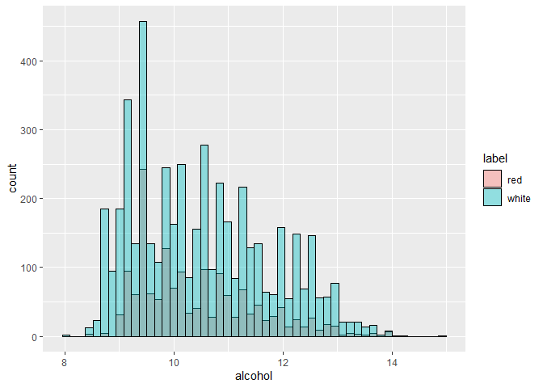
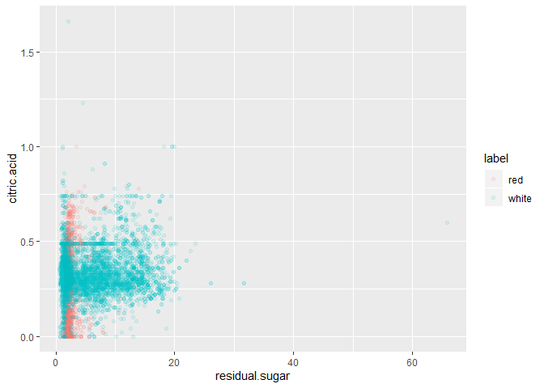
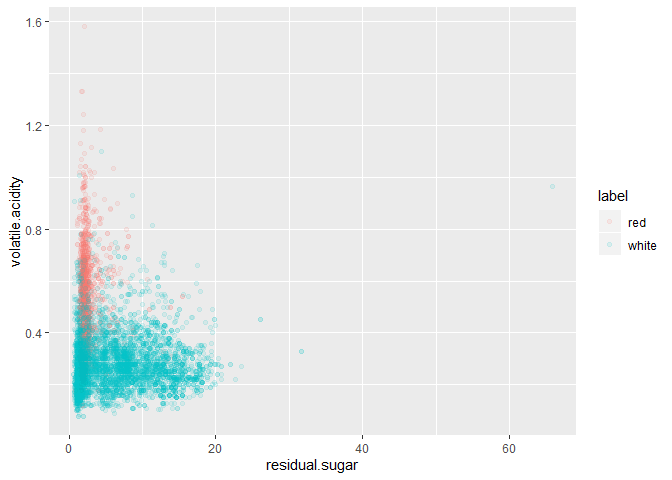

K Means Clustering Small Project
================
Author: Holiday Tang  
[LinkeDin](https://www.linkedin.com/in/holiday-t/) |
[GitHub](https://github.com/holiday007) | [Kaggle
Novice](https://www.kaggle.com/holibae007)
| Date: 2020-01-18

  - [Data](#data)
  - [EDA](#eda)

# Data

  - Read wine quality and white wine quality from [UCI
    Repository](http://archive.ics.uci.edu/ml/machine-learning-databases/wine-quality/)

<!-- end list -->

``` r
df1 = read.csv("winequality-red.csv", sep = ";")
df2 = read.csv("winequality-white.csv", sep = ";")

head(df1)
```

``` 
  fixed.acidity volatile.acidity citric.acid residual.sugar chlorides
1           7.4             0.70        0.00            1.9     0.076
2           7.8             0.88        0.00            2.6     0.098
3           7.8             0.76        0.04            2.3     0.092
4          11.2             0.28        0.56            1.9     0.075
5           7.4             0.70        0.00            1.9     0.076
6           7.4             0.66        0.00            1.8     0.075
  free.sulfur.dioxide total.sulfur.dioxide density   pH sulphates alcohol
1                  11                   34  0.9978 3.51      0.56     9.4
2                  25                   67  0.9968 3.20      0.68     9.8
3                  15                   54  0.9970 3.26      0.65     9.8
4                  17                   60  0.9980 3.16      0.58     9.8
5                  11                   34  0.9978 3.51      0.56     9.4
6                  13                   40  0.9978 3.51      0.56     9.4
  quality
1       5
2       5
3       5
4       6
5       5
6       5
```

``` r
head(df2)
```

``` 
  fixed.acidity volatile.acidity citric.acid residual.sugar chlorides
1           7.0             0.27        0.36           20.7     0.045
2           6.3             0.30        0.34            1.6     0.049
3           8.1             0.28        0.40            6.9     0.050
4           7.2             0.23        0.32            8.5     0.058
5           7.2             0.23        0.32            8.5     0.058
6           8.1             0.28        0.40            6.9     0.050
  free.sulfur.dioxide total.sulfur.dioxide density   pH sulphates alcohol
1                  45                  170  1.0010 3.00      0.45     8.8
2                  14                  132  0.9940 3.30      0.49     9.5
3                  30                   97  0.9951 3.26      0.44    10.1
4                  47                  186  0.9956 3.19      0.40     9.9
5                  47                  186  0.9956 3.19      0.40     9.9
6                  30                   97  0.9951 3.26      0.44    10.1
  quality
1       6
2       6
3       6
4       6
5       6
6       6
```

``` r
df1$label = "red"
```

``` r
df2$label = "white"
```

``` r
head(df1)
```

``` 
  fixed.acidity volatile.acidity citric.acid residual.sugar chlorides
1           7.4             0.70        0.00            1.9     0.076
2           7.8             0.88        0.00            2.6     0.098
3           7.8             0.76        0.04            2.3     0.092
4          11.2             0.28        0.56            1.9     0.075
5           7.4             0.70        0.00            1.9     0.076
6           7.4             0.66        0.00            1.8     0.075
  free.sulfur.dioxide total.sulfur.dioxide density   pH sulphates alcohol
1                  11                   34  0.9978 3.51      0.56     9.4
2                  25                   67  0.9968 3.20      0.68     9.8
3                  15                   54  0.9970 3.26      0.65     9.8
4                  17                   60  0.9980 3.16      0.58     9.8
5                  11                   34  0.9978 3.51      0.56     9.4
6                  13                   40  0.9978 3.51      0.56     9.4
  quality label
1       5   red
2       5   red
3       5   red
4       6   red
5       5   red
6       5   red
```

``` r
head(df2)
```

``` 
  fixed.acidity volatile.acidity citric.acid residual.sugar chlorides
1           7.0             0.27        0.36           20.7     0.045
2           6.3             0.30        0.34            1.6     0.049
3           8.1             0.28        0.40            6.9     0.050
4           7.2             0.23        0.32            8.5     0.058
5           7.2             0.23        0.32            8.5     0.058
6           8.1             0.28        0.40            6.9     0.050
  free.sulfur.dioxide total.sulfur.dioxide density   pH sulphates alcohol
1                  45                  170  1.0010 3.00      0.45     8.8
2                  14                  132  0.9940 3.30      0.49     9.5
3                  30                   97  0.9951 3.26      0.44    10.1
4                  47                  186  0.9956 3.19      0.40     9.9
5                  47                  186  0.9956 3.19      0.40     9.9
6                  30                   97  0.9951 3.26      0.44    10.1
  quality label
1       6 white
2       6 white
3       6 white
4       6 white
5       6 white
6       6 white
```

``` r
df = rbind(df1,df2)
dim(df1)
```

    [1] 1599   13

``` r
dim(df2)
```

    [1] 4898   13

``` r
dim(df)
```

    [1] 6497   13

``` r
str(df)
```

    'data.frame':   6497 obs. of  13 variables:
     $ fixed.acidity       : num  7.4 7.8 7.8 11.2 7.4 7.4 7.9 7.3 7.8 7.5 ...
     $ volatile.acidity    : num  0.7 0.88 0.76 0.28 0.7 0.66 0.6 0.65 0.58 0.5 ...
     $ citric.acid         : num  0 0 0.04 0.56 0 0 0.06 0 0.02 0.36 ...
     $ residual.sugar      : num  1.9 2.6 2.3 1.9 1.9 1.8 1.6 1.2 2 6.1 ...
     $ chlorides           : num  0.076 0.098 0.092 0.075 0.076 0.075 0.069 0.065 0.073 0.071 ...
     $ free.sulfur.dioxide : num  11 25 15 17 11 13 15 15 9 17 ...
     $ total.sulfur.dioxide: num  34 67 54 60 34 40 59 21 18 102 ...
     $ density             : num  0.998 0.997 0.997 0.998 0.998 ...
     $ pH                  : num  3.51 3.2 3.26 3.16 3.51 3.51 3.3 3.39 3.36 3.35 ...
     $ sulphates           : num  0.56 0.68 0.65 0.58 0.56 0.56 0.46 0.47 0.57 0.8 ...
     $ alcohol             : num  9.4 9.8 9.8 9.8 9.4 9.4 9.4 10 9.5 10.5 ...
     $ quality             : int  5 5 5 6 5 5 5 7 7 5 ...
     $ label               : chr  "red" "red" "red" "red" ...

# EDA

**Residual Sugar**

``` r
library(ggplot2)

ggplot(df, aes(x = residual.sugar)) + 
  geom_histogram(aes(fill = label), color = "black", bins = 50, 
                 position = "identity", alpha=0.2)
```

<!-- -->

``` r
ggplot(df, aes(x = citric.acid)) + 
  geom_histogram(aes(fill = label), color = "black", bins = 50, position = "identity", alpha = 0.4)
```

<!-- -->

``` r
ggplot(df, aes(x = alcohol)) + 
  geom_histogram(aes(fill = label), color = "black", bins = 50, position = "identity", alpha = 0.4)
```

<!-- -->

``` r
ggplot(df, aes(x = residual.sugar, y = citric.acid)) + 
  geom_point(aes(color = label), alpha=0.1)
```

<!-- -->

``` r
ggplot(df, aes(x = residual.sugar, y = volatile.acidity)) + 
  geom_point(aes(color = label), alpha=0.1)
```

<!-- -->

**Grab data withoout label**

``` r
clus.data = df[,-13]
head(clus.data)
```

``` 
  fixed.acidity volatile.acidity citric.acid residual.sugar chlorides
1           7.4             0.70        0.00            1.9     0.076
2           7.8             0.88        0.00            2.6     0.098
3           7.8             0.76        0.04            2.3     0.092
4          11.2             0.28        0.56            1.9     0.075
5           7.4             0.70        0.00            1.9     0.076
6           7.4             0.66        0.00            1.8     0.075
  free.sulfur.dioxide total.sulfur.dioxide density   pH sulphates alcohol
1                  11                   34  0.9978 3.51      0.56     9.4
2                  25                   67  0.9968 3.20      0.68     9.8
3                  15                   54  0.9970 3.26      0.65     9.8
4                  17                   60  0.9980 3.16      0.58     9.8
5                  11                   34  0.9978 3.51      0.56     9.4
6                  13                   40  0.9978 3.51      0.56     9.4
  quality
1       5
2       5
3       5
4       6
5       5
6       5
```

``` r
wine.cluster = kmeans(x = clus.data, centers = 2, nstart = 25)
```

``` r
wine.cluster$centers
```

``` 
  fixed.acidity volatile.acidity citric.acid residual.sugar  chlorides
1      6.904812        0.2871659   0.3397642       7.244809 0.04859257
2      7.623219        0.4086378   0.2908725       3.076425 0.06580983
  free.sulfur.dioxide total.sulfur.dioxide   density       pH sulphates
1            39.75590            155.69246 0.9947903 3.190808 0.4999485
2            18.39868             63.26318 0.9945736 3.254882 0.5724145
   alcohol  quality
1 10.25932 5.824343
2 10.79722 5.810541
```

``` r
table(factor(df$label, levels = c("white", "red")), wine.cluster$cluster)
```

``` 
       
           1    2
  white 3604 1294
  red     85 1514
```
