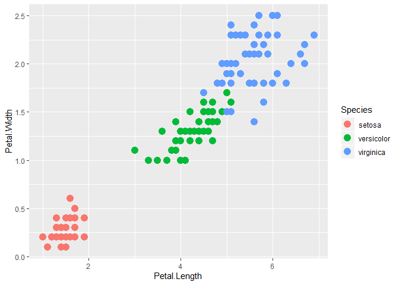
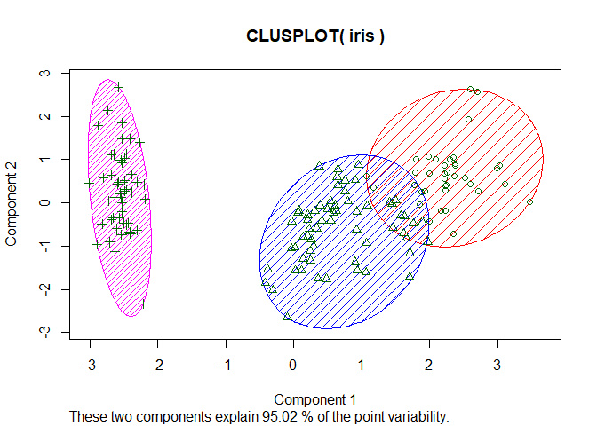

K Means Clustering
================
Author: Holiday Tang  
[LinkeDin](https://www.linkedin.com/in/holiday-t/) |
[GitHub](https://github.com/holiday007) | [Kaggle
Novice](https://www.kaggle.com/holibae007)
| Date: 2020-01-02

  - [What is K means clustering?](#what-is-k-means-clustering)
  - [Implementation](#implementation)

(Note: adopted from *Data Scicence and Machine Learning Bootcamp with R*
by *Jose Portilla* from Udemy)

# What is K means clustering?

Unsupervised learning algorithm that attempt tp group similar clusters
together in your data.

What is it commonly used for?

  - Cluster similar documents
  - Cluster customers based on features
  - Market segmentation

The overall goal is to divide data into distinct groups such that
obervations within each group are similar.

**Algorithm overview:**

  - Choose a number of clusters “K”
  - Randomly assigned each point to a cluster
  - Repeat the following:
      - For each cluster, compute the cluster centroid by taking the
        **mean vector** of points in the cluster
      - Assign each data point to the cluster for which the centroid is
        the closest
      - Stop repetition when the clusters stop changing

**Choosing a “k” value"**

  - No easy answer
  - A common way is the elbow method:
    1.  compute the sum of squared error (SSE) for some values of “k”
        (SSE is defined as the sum of squared distance between cluster
        members and their centroid)
    2.  If you plot k against the SSE, you will see that the error
        decreases as k gets larger; larger k -\> smaller clusters,
        smaller clusters, smaller variance (when the algorithm is done)
        -\> smaller error, an extreme case is when k = n(sample size),
        the clusters will have 0 error
    3.  choose a k which the SSE decrease abruptly (capturing the most
        variance with a unit increment of the parameter), this creates
        an “elbow effect”:
    

# Implementation

Data - Iris data set

``` r
head(iris)
```

``` 
  Sepal.Length Sepal.Width Petal.Length Petal.Width Species
1          5.1         3.5          1.4         0.2  setosa
2          4.9         3.0          1.4         0.2  setosa
3          4.7         3.2          1.3         0.2  setosa
4          4.6         3.1          1.5         0.2  setosa
5          5.0         3.6          1.4         0.2  setosa
6          5.4         3.9          1.7         0.4  setosa
```

``` r
library(ggplot2)
pl = ggplot(iris, aes(Petal.Length, Petal.Width, color = Species))

pl + geom_point(size=4)
```

<!-- -->

Model

``` r
set.seed(101)

irisCluster = kmeans(x=iris[,1:4], centers = 3, nstart = 20)

irisCluster
```

``` 
K-means clustering with 3 clusters of sizes 38, 62, 50

Cluster means:
  Sepal.Length Sepal.Width Petal.Length Petal.Width
1     6.850000    3.073684     5.742105    2.071053
2     5.901613    2.748387     4.393548    1.433871
3     5.006000    3.428000     1.462000    0.246000

Clustering vector:
  [1] 3 3 3 3 3 3 3 3 3 3 3 3 3 3 3 3 3 3 3 3 3 3 3 3 3 3 3 3 3 3 3 3 3 3 3
 [36] 3 3 3 3 3 3 3 3 3 3 3 3 3 3 3 2 2 1 2 2 2 2 2 2 2 2 2 2 2 2 2 2 2 2 2
 [71] 2 2 2 2 2 2 2 1 2 2 2 2 2 2 2 2 2 2 2 2 2 2 2 2 2 2 2 2 2 2 1 2 1 1 1
[106] 1 2 1 1 1 1 1 1 2 2 1 1 1 1 2 1 2 1 2 1 1 2 2 1 1 1 1 1 2 1 1 1 1 2 1
[141] 1 1 2 1 1 1 2 1 1 2

Within cluster sum of squares by cluster:
[1] 23.87947 39.82097 15.15100
 (between_SS / total_SS =  88.4 %)

Available components:

[1] "cluster"      "centers"      "totss"        "withinss"    
[5] "tot.withinss" "betweenss"    "size"         "iter"        
[9] "ifault"      
```

Clustering outcomes compared to original label

``` r
table(irisCluster$cluster, iris$Species)
```

``` 
   
    setosa versicolor virginica
  1      0          2        36
  2      0         48        14
  3     50          0         0
```

``` r
cluster::clusplot(iris, irisCluster$cluster, color = T, shade = T,
                  labels = 0, lines = 0)
```

<!-- -->
