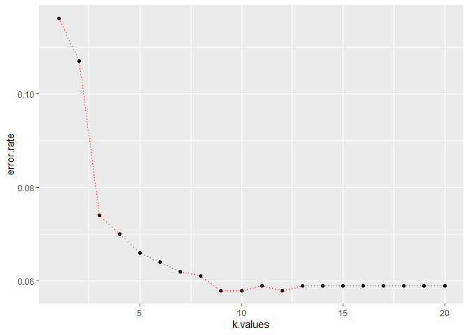

K Nearest Neighbor (Classification) Practice
================
Author: Holiday Tang  
[LinkeDin](https://www.linkedin.com/in/holiday-t/) |
[GitHub](https://github.com/holiday007) | [Kaggle
Novice](https://www.kaggle.com/holibae007)
Date: 2019-12-29

  - [Algorithim](#algorithim)
  - [K](#k)
  - [Pros and Cons](#pros-and-cons)
      - [Pros:](#pros)
      - [Cons:](#cons)
  - [Implementation](#implementation)
      - [Data](#data)

(Note: adopted from *Data Scicence and Machine Learning Bootcamp with R*
by *Jose Portilla* from Udemy)

# Algorithim

Training Algorithm:

  - Store all the data

Prediction Algorithm:

1.  Calculate distances between x to all data points, x being a new data
    point
2.  Sort the distances in ascending order
3.  Predict the majority label of the “k” closest points (if there is a
    tie, pick either)

# K

Choosing a K will affect what class a new point is assigned to

# Pros and Cons

### Pros:

  - Very simple
  - Training is trivial
  - Works with any number of classes
  - Easy to add more data
  - Few parameters
      - K
      - Distance Metric

### Cons:

  - High prediction costs (sorting is expensive)
  - Not good with high dimensional data (calculation of distance becomes
    complicated)
  - Does not accommadate (nominal) categorical variables

# Implementation

##### Data

Official Descriptions:

The data contains 5822 real customer records. Each record consists of 86
variables, containing sociodemographic data (variables 1-43) and product
ownership (variables 44-86). The sociodemographic data is derived from
zip codes. All customers living in areas with the same zip code have the
same sociodemographic attributes. Variable 86 (Purchase) indicates
whether the customer purchased a caravan insurance policy. Further
information on the individual variables can be obtained at
<http://www.liacs.nl/~putten/library/cc2000/data.html>

``` r
# get the data

library(ISLR) # for the Caravan data set
# take a look at the dimension
dim(Caravan)
```

    [1] 5822   86

``` r
# take a look at the first observation
head(Caravan,1)
```

``` 
  MOSTYPE MAANTHUI MGEMOMV MGEMLEEF MOSHOOFD MGODRK MGODPR MGODOV MGODGE
1      33        1       3        2        8      0      5      1      3
  MRELGE MRELSA MRELOV MFALLEEN MFGEKIND MFWEKIND MOPLHOOG MOPLMIDD
1      7      0      2        1        2        6        1        2
  MOPLLAAG MBERHOOG MBERZELF MBERBOER MBERMIDD MBERARBG MBERARBO MSKA
1        7        1        0        1        2        5        2    1
  MSKB1 MSKB2 MSKC MSKD MHHUUR MHKOOP MAUT1 MAUT2 MAUT0 MZFONDS MZPART
1     1     2    6    1      1      8     8     0     1       8      1
  MINKM30 MINK3045 MINK4575 MINK7512 MINK123M MINKGEM MKOOPKLA PWAPART
1       0        4        5        0        0       4        3       0
  PWABEDR PWALAND PPERSAUT PBESAUT PMOTSCO PVRAAUT PAANHANG PTRACTOR
1       0       0        6       0       0       0        0        0
  PWERKT PBROM PLEVEN PPERSONG PGEZONG PWAOREG PBRAND PZEILPL PPLEZIER
1      0     0      0        0       0       0      5       0        0
  PFIETS PINBOED PBYSTAND AWAPART AWABEDR AWALAND APERSAUT ABESAUT AMOTSCO
1      0       0        0       0       0       0        1       0       0
  AVRAAUT AAANHANG ATRACTOR AWERKT ABROM ALEVEN APERSONG AGEZONG AWAOREG
1       0        0        0      0     0      0        0       0       0
  ABRAND AZEILPL APLEZIER AFIETS AINBOED ABYSTAND Purchase
1      1       0        0      0       0        0       No
```

``` r
# take a look at the response variable
summary(Caravan$Purchase)
```

``` 
  No  Yes 
5474  348 
```

``` r
# missing values?

anyNA(Caravan)
```

    [1] FALSE

**Note: It is important to standardize variables for variables on a
larger scale can have a larger influence on the distance**

``` r
# to illustrate, let's take a look at the variance of two different variables
var(Caravan[,1])
```

    [1] 165.0378

``` r
var(Caravan[,2])
```

    [1] 0.1647078

``` r
# standardizing variables

purchase = Caravan[,86]

standardized.Caravan = scale(Caravan[,-86])
var(standardized.Caravan[,1])
```

    [1] 1

``` r
var(standardized.Caravan[,2])
```

    [1] 1

``` r
# Train Test Split (consider catools)

test.index = 1:1000
test.data = standardized.Caravan[test.index,]
test.purchase = purchase[test.index]

train.data = standardized.Caravan[-test.index,]
train.purchase = purchase[-test.index]
```

``` r
# KNN model

library(class) # for KNN function
set.seed(101)

predicted.purchase = knn(train.data, test.data, train.purchase, k = 1)

head(predicted.purchase)
```

    [1] No No No No No No
    Levels: No Yes

``` r
# model assessment

# misclassification error
misclass.error = mean(test.purchase != predicted.purchase)
misclass.error
```

    [1] 0.116

``` r
# choosing K

predicted.purchase = NULL
error.rate = NULL

for (i in 1:20){
  set.seed(101)
  predicted.purchase = knn(train.data, test.data, train.purchase, k = i)
  error.rate[i] = mean(test.purchase != predicted.purchase)
}

error.rate
```

``` 
 [1] 0.116 0.107 0.074 0.070 0.066 0.064 0.062 0.061 0.058 0.058 0.059
[12] 0.058 0.059 0.059 0.059 0.059 0.059 0.059 0.059 0.059
```

``` r
# visualize this

library(ggplot2)
k.values = 1:20
error.df = data.frame(error.rate, k.values)

ggplot(error.df, aes(k.values, error.rate)) + 
  geom_point() +
  geom_line(lty="dotted", color = "red")
```

<!-- -->
