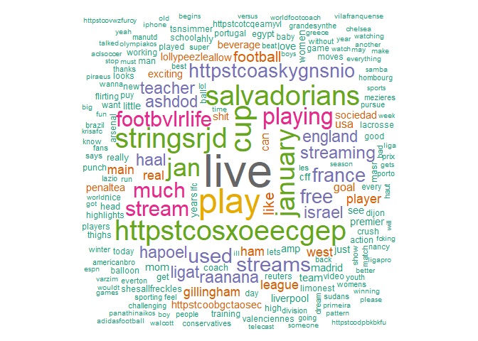

Natural Language Processing Practice
================
Author: Holiday Tang  
[LinkeDin](https://www.linkedin.com/in/holiday-t/) |
[GitHub](https://github.com/holiday007) | [Kaggle
Novice](https://www.kaggle.com/holibae007)
Date: 2020-01-05

  - [Introduction to natural language
    processing](#introduction-to-natural-language-processing)

(Note: adopted from *Data Scicence and Machine Learning Bootcamp with R*
by *Jose Portilla* from Udemy)

# Introduction to natural language processing

Potential purpose:

  - Find relevant documents
  - Group articles by topic

We will want to:

  - compile documents
  - Featurize them
  - Compare their features

Featurization:

  - one option is based on **word counts**
  - use consine similarity on the vectors made to determine similarity:

  
 = cos(\\theta) = \\frac{A\\cdot B}{||A||*||B||}
")  

We can improve on Bag of words by adjusting word counts based on their
frequency in corpus, the group of all documents.

We can use TF-IDF (Term Frequency-Inverse Document Frequency)

  - Term frequency - **Importance** of the term within that document
      - TF(d,t) = Number of occurences of term t in document d
  - Inverse document frequency - how important a word is to a document
    in a collection or corpus.
      - IDF(t) = log(D/t)
          - D = total number of documents
          - t = number of documents with the term
          - so for term x within document y

  

")  

  -  - frequency of x in y
  -  - number
    of documents containing x
  - N - total number of documents

The tf–idf value increases proportionally to the number of times a word
appears in the document and is offset by the number of documents in the
corpus that contain the word, which helps to adjust for the fact that
some words appear more frequently in general.

``` r
library(twitteR)
library(tm)
library(wordcloud)
library(RColorBrewer)
```

Connect to twitter

``` r
ckey = "A7pB8aV2Gf7cTDjJDjBsmXCBY"
cskey = "lEwtyOQUq7rePc8XDIxnjC1oyxbuL3vcVkygsb499BMAk0jBR7"
token = "1183026577715744769-4cyyVR2UaJ4SBoSFcCcnqR0rzkJvWR"
sec.token = "K8rB8j9QxUVfChcqNJES4MydbV85rihzHbG0YkJZno0Rw"
setup_twitter_oauth(ckey, cskey, token, sec.token) # set up authorization
```

    [1] "Using direct authentication"

Search twitters

``` r
# returning tweets
soccer.tweets = searchTwitter("soccer", 
                              n = 1000,
                              lang = "en")
```

``` r
soccer.tweets[1:5]
```

    [[1]]
    [1] "Cantona75: RT @worldfootcoach: England - fun races\n\n#england #football #soccer #coach #Training https://t.co/pIdphXbRUV"
    
    [[2]]
    [1] "CNECBroncos: RT @CN_GIRLS_SOCCER: CN Girls Soccer finish preseason undefeated w/ a record of 10-0-2! Now CN girls soccer is ready to take on the TRAC! F…"
    
    [[3]]
    [1] "_om_1996: RT @FOOTBVLRLIFE: playing soccer as much as I used too https://t.co/ASKyGnsnio"
    
    [[4]]
    [1] "anujnepali8: @LFC Soccer punch goal"
    
    [[5]]
    [1] "ClaytonDeth: RT @BronzeHammer: My really unathletic friend who lives in Vancouver shredded his knee playing (low level) soccer and he was immediately se…"

``` r
# grabbing text data from tweets
soccer.text = sapply(soccer.tweets, function(x) x$getText())
```

``` r
soccer.text[1:5]
```

    [1] "RT @worldfootcoach: England - fun races\n\n#england #football #soccer #coach #Training https://t.co/pIdphXbRUV"                              
    [2] "RT @CN_GIRLS_SOCCER: CN Girls Soccer finish preseason undefeated w/ a record of 10-0-2! Now CN girls soccer is ready to take on the TRAC! F…"
    [3] "RT @FOOTBVLRLIFE: playing soccer as much as I used too https://t.co/ASKyGnsnio"                                                              
    [4] "@LFC Soccer punch goal"                                                                                                                      
    [5] "RT @BronzeHammer: My really unathletic friend who lives in Vancouver shredded his knee playing (low level) soccer and he was immediately se…"

Clean Text Data (remove emoticons)

``` r
# iconv() - an encoding function
soccer.text = iconv(soccer.text, 'UTF-8', "ASCII") # remove emoticons and characters that are not in utf8
soccer.text[1:5]
```

``` 
[1] "RT @worldfootcoach: England - fun races\n\n#england #football #soccer #coach #Training https://t.co/pIdphXbRUV"
[2] NA                                                                                                              
[3] "RT @FOOTBVLRLIFE: playing soccer as much as I used too https://t.co/ASKyGnsnio"                                
[4] "@LFC Soccer punch goal"                                                                                        
[5] NA                                                                                                              
```

Create a corpus

``` r
# VectorSource - creates a vector source from the text data
soccer.corpus = Corpus(VectorSource(soccer.text))
```

``` r
soccer.corpus
```

    <<SimpleCorpus>>
    Metadata:  corpus specific: 1, document level (indexed): 0
    Content:  documents: 1000

Document term matrix

``` r
term.doc.matrix = TermDocumentMatrix(soccer.corpus,
            # control - a list of actions to do on every document in the corpus
                                     control = list(removePunctuation = T,
            # stop words - really common words that do not add a lot of info, basically removing them here
                                                    stopwords = c("soccer",
                                                                  stopwords("en")),
                                                    removeNumbers = T, 
                                                    tolower=T))
```

Convert Term Document Matrix into an actual matrix

``` r
term.doc.matrix = as.matrix(term.doc.matrix)
term.doc.matrix[1:3,1:3]
```

``` 
          Docs
Terms      1 2 3
  coach    1 0 0
  england  2 0 0
  football 1 0 0
```

Get the word counts

``` r
word.freq = sort(rowSums(term.doc.matrix), decreasing = T)
word.freq[1:5]
```

``` 
             live              play               cup httpstcosxoeecgep 
               75                55                45                43 
     salvadorians 
               43 
```

``` r
dm = data.frame(word = names(word.freq), freq = word.freq)
```

Create the word cloud

``` r
wordcloud(dm$word,dm$freq, random.order = FALSE, colors = brewer.pal(8, "Dark2"))
```

<!-- -->
