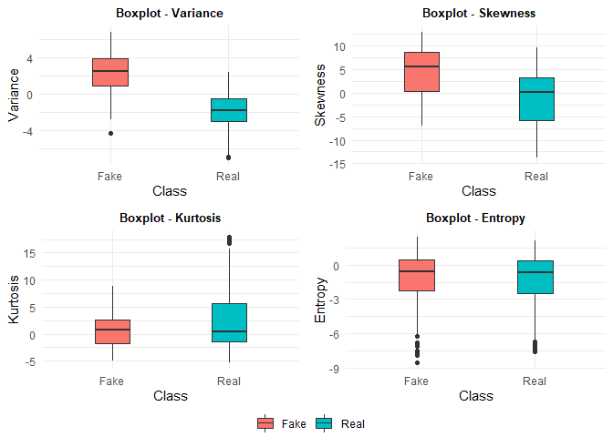
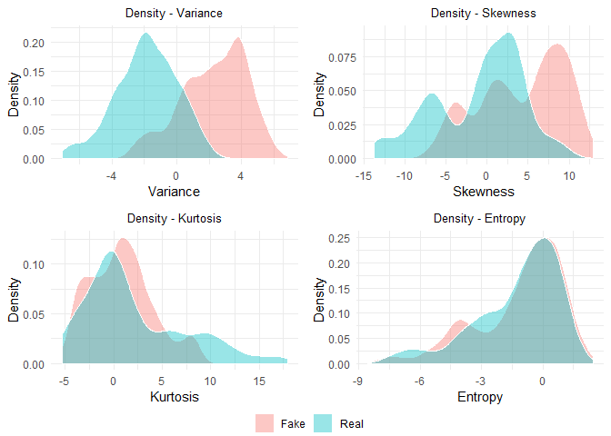

Insert Title
================
Holiday Tang
| Date: 2019-10-17

  - [Reading data](#reading-data)
  - [EDA](#eda)
      - [boxplot](#boxplot)
      - [density plot](#density-plot)
  - [Train-Test Split](#train-test-split)
  - [Training Model](#training-model)
      - [Apply model on test set](#apply-model-on-test-set)
      - [Model Performance (Confusion
        Matrix)](#model-performance-confusion-matrix)

# Reading data

Showing brief summary and the first 10 entries

``` r
library(readr)
data = read_csv("bank_note_data.csv")

tibble::glimpse(data)
```

    Observations: 1,372
    Variables: 5
    $ Image.Var  <dbl> 3.62160, 4.54590, 3.86600, 3.45660, 0.32924, 4.3684...
    $ Image.Skew <dbl> 8.6661, 8.1674, -2.6383, 9.5228, -4.4552, 9.6718, 3...
    $ Image.Curt <dbl> -2.80730, -2.45860, 1.92420, -4.01120, 4.57180, -3....
    $ Entropy    <dbl> -0.44699, -1.46210, 0.10645, -3.59440, -0.98880, -3...
    $ Class      <dbl> 0, 0, 0, 0, 0, 0, 0, 0, 0, 0, 0, 0, 0, 0, 0, 0, 0, ...

``` r
names(data)[1:3] = c("Variance", "Skewness", "Kurtosis")

# Class as factor

head(data, 10)
```

    # A tibble: 10 x 5
       Variance Skewness Kurtosis Entropy Class
          <dbl>    <dbl>    <dbl>   <dbl> <dbl>
     1    3.62      8.67   -2.81   -0.447     0
     2    4.55      8.17   -2.46   -1.46      0
     3    3.87     -2.64    1.92    0.106     0
     4    3.46      9.52   -4.01   -3.59      0
     5    0.329    -4.46    4.57   -0.989     0
     6    4.37      9.67   -3.96   -3.16      0
     7    3.59      3.01    0.729   0.564     0
     8    2.09     -6.81    8.46   -0.602     0
     9    3.20      5.76   -0.753  -0.613     0
    10    1.54      9.18   -2.27   -0.735     0

# EDA

## boxplot

``` r
library(ggplot2)
theme_set(theme_minimal())
library(gridExtra) # grid.arrange(p1, p2, nrow =)
# boxplot for each variable separated by class

# extracting legend
get_legend = function(a_ggplot){
  tmp=ggplot_gtable(ggplot_build(a_ggplot))
  leg=which(sapply(tmp$grobs, function(x) x$name == "guide-box"))
  legend = tmp$grobs[[leg]]
  return(legend)
}

# Variance - p1

p1 = ggplot(data, aes(x=factor(data$Class,labels = c("Fake", "Real")), y=Variance, fill=factor(data$Class,labels = c("Fake", "Real")))) + 
  geom_boxplot(width = 0.3) + 
  ggtitle("Boxplot - Variance") + 
  labs(x="Class") +
  theme(legend.position = "none", plot.title = element_text(
    size = 10, hjust = 0.5, face= "bold"
  ))

p2 = ggplot(data, aes(x=factor(data$Class,labels = c("Fake", "Real")), y=Skewness, fill=factor(data$Class,labels = c("Fake", "Real")))) +
  geom_boxplot(width = 0.3) +
  ggtitle("Boxplot - Skewness") +
  labs(x="Class") +
  theme(legend.position = "none", plot.title = element_text(
    size=10, hjust=0.5, face="bold"
  ))

p3 = ggplot(data, aes(x=factor(data$Class,labels = c("Fake", "Real")), y=Kurtosis, fill=factor(data$Class,labels = c("Fake", "Real")))) + 
  geom_boxplot(width = 0.3) +
  ggtitle("Boxplot - Kurtosis") +
  labs(x="Class") +
  theme(legend.position = "none", plot.title = element_text(
    size=10, hjust=0.5, face="bold"
  ))

p4 = ggplot(data, aes(x=factor(data$Class,labels = c("Fake", "Real")), y=Entropy, fill=factor(data$Class,labels = c("Fake", "Real")))) + 
  geom_boxplot(width=0.3) +
  ggtitle("Boxplot - Entropy") +
  labs(x = "Class") +
  theme(plot.title = element_text(
    size=10, hjust = 0.5, face = "bold"
  ), legend.title = element_blank(), legend.position = "bottom")

leg = get_legend(p4)

grid.arrange(arrangeGrob(p1,p2,p3,p4 + theme(legend.position = "none")), leg, nrow=2, heights = c(15,1))
```

<!-- -->

## density plot

``` r
# extract the mean for each predictors
library(dplyr)

p1 = ggplot(data, aes(x=Variance, fill=factor(data$Class,labels = c("Fake", "Real")))) +
  geom_density(alpha=0.4, color="white") + 
  labs(y="Density", title = "Density - Variance") +
  theme(legend.position = "none", plot.title=element_text(size=10, hjust=0.5))

p2 = ggplot(data, aes(x=Skewness, fill=factor(data$Class,labels = c("Fake", "Real")))) + 
  geom_density(alpha=0.4,color="white") +
  labs(y="Density", title="Density - Skewness")+
  theme(legend.position = "none", plot.title=element_text(size=10, hjust=0.5))

p3 = ggplot(data, aes(x=Kurtosis, fill=factor(data$Class,labels = c("Fake", "Real"))))+
  geom_density(alpha=0.4, color="white") +
  labs(y="Density", title="Density - Kurtosis")+
  theme(legend.position = "none", plot.title=element_text(size=10, hjust=0.5))

p4 = ggplot(data, aes(x=Entropy, fill=factor(data$Class,labels = c("Fake", "Real")))) + 
  geom_density(alpha=0.4, color="white") +
  labs(y="Density", title="Density - Entropy")+
  theme(legend.position = "bottom", plot.title=element_text(size=10, hjust=0.5), legend.title = element_blank())

leg = get_legend(p4)

grid.arrange(arrangeGrob(p1,p2,p3,p4+theme(legend.position = "none")),leg, nrow=2, heights = c(16,1))
```

<!-- -->

As we can see, variance gives us very good power to distinguish between
the two classes

# Train-Test Split

Take a glance at the splitted data

``` r
library(caTools)

split = sample.split(data$Class, SplitRatio = .7)
train=subset(data, split==T)
test=subset(data, split==F)

str(train)
```

    Classes 'tbl_df', 'tbl' and 'data.frame':   960 obs. of  5 variables:
     $ Variance: num  3.457 0.329 4.368 3.591 2.092 ...
     $ Skewness: num  9.52 -4.46 9.67 3.01 -6.81 ...
     $ Kurtosis: num  -4.011 4.572 -3.961 0.729 8.464 ...
     $ Entropy : num  -3.594 -0.989 -3.163 0.564 -0.602 ...
     $ Class   : num  0 0 0 0 0 0 0 0 0 0 ...

``` r
str(test)
```

    Classes 'tbl_df', 'tbl' and 'data.frame':   412 obs. of  5 variables:
     $ Variance: num  3.62 4.55 3.87 2.67 5.24 ...
     $ Skewness: num  8.67 8.17 -2.64 3.06 11.03 ...
     $ Kurtosis: num  -2.807 -2.459 1.924 0.372 -4.353 ...
     $ Entropy : num  -0.447 -1.462 0.106 0.586 -4.101 ...
     $ Class   : num  0 0 0 0 0 0 0 0 0 0 ...

# Training Model

Training model with 10 hidden layers

``` r
library(neuralnet)

n = names(train)
f=as.formula(paste("Class ~ ", paste(n[!n %in% "Class"], collapse = " + ")))
model = neuralnet(f, data=train, hidden=10, linear.output = F)
```

## Apply model on test set

Applying the model on the test set to predict the classes

``` r
predictions = compute(model, test[1:4])
predictions_class = ifelse(predictions$net.result >= 0.5, 1, 0)[,1]
```

## Model Performance (Confusion Matrix)

``` r
knitr::kable(table(test[[5]], predictions_class))
```

|   |   0 |   1 |
| - | --: | --: |
| 0 | 229 |   0 |
| 1 |   0 | 183 |

Accuracy is 100% \!
