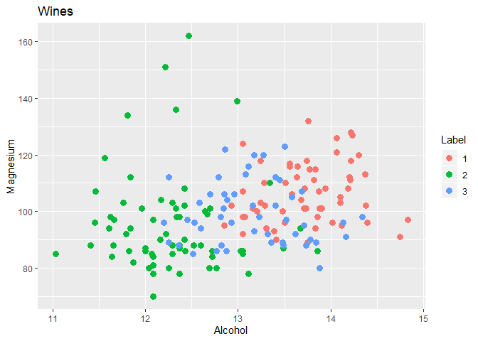
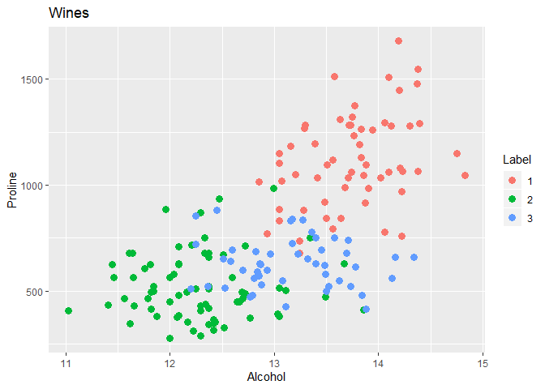
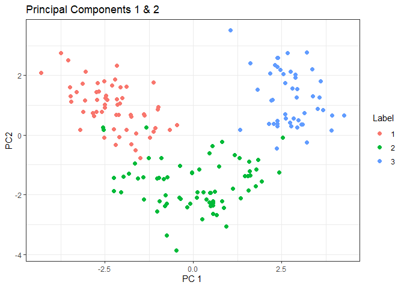
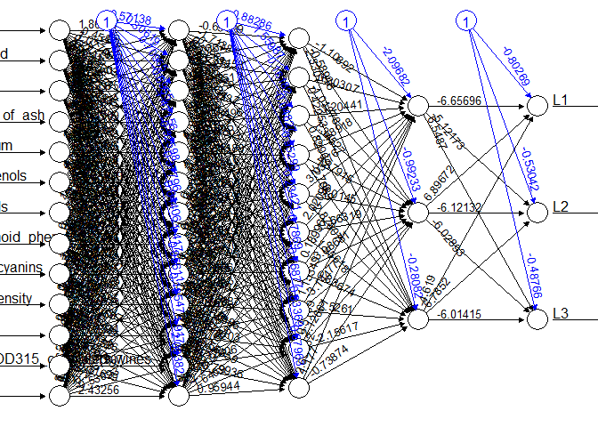

Neural Net (neuralnet) - Multi-label Classification
================
Holiday Tang
| Date: 2019-10-19

  - [Reading Data](#reading-data)
  - [Basic Visualization](#basic-visualization)
      - [Principal Component
        Extraction](#principal-component-extraction)
  - [Processing](#processing)
      - [Encode categorical variables](#encode-categorical-variables)
      - [Standardize the predictors](#standardize-the-predictors)
  - [Fitting Model](#fitting-model)
  - [Cross Validation](#cross-validation)
  - [Using principal components](#using-principal-components)
      - [Cross Validation](#cross-validation-1)

Source - [R-blogger
post](https://www.r-bloggers.com/multilabel-classification-with-neuralnet-package/)

# Reading Data

``` r
data = readr::read_csv("wine.csv", col_names = FALSE)
tibble::glimpse(data)
```

    Observations: 178
    Variables: 14
    $ X1  <dbl> 1, 1, 1, 1, 1, 1, 1, 1, 1, 1, 1, 1, 1, 1, 1, 1, 1, 1, 1, 1...
    $ X2  <dbl> 14.23, 13.20, 13.16, 14.37, 13.24, 14.20, 14.39, 14.06, 14...
    $ X3  <dbl> 1.71, 1.78, 2.36, 1.95, 2.59, 1.76, 1.87, 2.15, 1.64, 1.35...
    $ X4  <dbl> 2.43, 2.14, 2.67, 2.50, 2.87, 2.45, 2.45, 2.61, 2.17, 2.27...
    $ X5  <dbl> 15.6, 11.2, 18.6, 16.8, 21.0, 15.2, 14.6, 17.6, 14.0, 16.0...
    $ X6  <dbl> 127, 100, 101, 113, 118, 112, 96, 121, 97, 98, 105, 95, 89...
    $ X7  <dbl> 2.80, 2.65, 2.80, 3.85, 2.80, 3.27, 2.50, 2.60, 2.80, 2.98...
    $ X8  <dbl> 3.06, 2.76, 3.24, 3.49, 2.69, 3.39, 2.52, 2.51, 2.98, 3.15...
    $ X9  <dbl> 0.28, 0.26, 0.30, 0.24, 0.39, 0.34, 0.30, 0.31, 0.29, 0.22...
    $ X10 <dbl> 2.29, 1.28, 2.81, 2.18, 1.82, 1.97, 1.98, 1.25, 1.98, 1.85...
    $ X11 <dbl> 5.64, 4.38, 5.68, 7.80, 4.32, 6.75, 5.25, 5.05, 5.20, 7.22...
    $ X12 <dbl> 1.04, 1.05, 1.03, 0.86, 1.04, 1.05, 1.02, 1.06, 1.08, 1.01...
    $ X13 <dbl> 3.92, 3.40, 3.17, 3.45, 2.93, 2.85, 3.58, 3.58, 2.85, 3.55...
    $ X14 <dbl> 1065, 1050, 1185, 1480, 735, 1450, 1290, 1295, 1045, 1045,...

``` r
names(data) = c("label",
                  "Alcohol",
                  "Malic_acid",
                  "Ash",
                  "Alcalinity_of_ash",
                  "Magnesium",
                  "Total_phenols",
                  "Flavanoids",
                  "Nonflavanoid_phenols",
                  "Proanthocyanins",
                  "Color_intensity",
                  "Hue",
                  "OD280_OD315_of_diluted_wines",
                  "Proline")
head(data)
```

    # A tibble: 6 x 14
      label Alcohol Malic_acid   Ash Alcalinity_of_a~ Magnesium Total_phenols
      <dbl>   <dbl>      <dbl> <dbl>            <dbl>     <dbl>         <dbl>
    1     1    14.2       1.71  2.43             15.6       127          2.8 
    2     1    13.2       1.78  2.14             11.2       100          2.65
    3     1    13.2       2.36  2.67             18.6       101          2.8 
    4     1    14.4       1.95  2.5              16.8       113          3.85
    5     1    13.2       2.59  2.87             21         118          2.8 
    6     1    14.2       1.76  2.45             15.2       112          3.27
    # ... with 7 more variables: Flavanoids <dbl>, Nonflavanoid_phenols <dbl>,
    #   Proanthocyanins <dbl>, Color_intensity <dbl>, Hue <dbl>,
    #   OD280_OD315_of_diluted_wines <dbl>, Proline <dbl>

Note:

  - Labels identify 3 different wine quality

# Basic Visualization

``` r
library(ggplot2)

p1 = ggplot(data, aes(x = Alcohol, y = Magnesium, colour = as.factor(label))) +
    geom_point(size=3) +
    ggtitle("Wines") +
  labs(color = "Label")
p2 = ggplot(data, aes(x = Alcohol, y = Proline, colour = as.factor(label))) +
    geom_point(size=3) +
  ggtitle("Wines") +
  labs(color = "Label")

p1
```

<!-- -->

``` r
p2
```

<!-- -->

## Principal Component Extraction

``` r
data.pca = prcomp(data[,-1], center=T, scale=T)
# turn pricipal components into a tibble
PCs = tibble::as.tibble(data.pca$x)
PCs = cbind(data$label, PCs)
names(PCs)[1] = "label"

ggplot(PCs, aes(x=PC1, y=PC2, color=as.factor(label))) +
  geom_point(size=2) + 
  labs(x="PC 1", y="PC2", color="Label") +
  ggtitle("Principal Components 1 & 2") + 
  theme_bw()
```

<!-- -->

  - Looks like PC 1 and PC 2 separate the labels pretty well, so using
    principal components to fit a model might be worth the efforts

(also, biplot might be helpful)

# Processing

### Encode categorical variables

  - `nnet` provides a good function for this

<!-- end list -->

``` r
library(nnet)

data = cbind(data[,2:14], 
             class.ind(as.factor(data$label)))

names(data) = c(names(data[,1:13]), "L1", "L2", "L3")
head(data)
```

``` 
  Alcohol Malic_acid  Ash Alcalinity_of_ash Magnesium Total_phenols
1   14.23       1.71 2.43              15.6       127          2.80
2   13.20       1.78 2.14              11.2       100          2.65
3   13.16       2.36 2.67              18.6       101          2.80
4   14.37       1.95 2.50              16.8       113          3.85
5   13.24       2.59 2.87              21.0       118          2.80
6   14.20       1.76 2.45              15.2       112          3.27
  Flavanoids Nonflavanoid_phenols Proanthocyanins Color_intensity  Hue
1       3.06                 0.28            2.29            5.64 1.04
2       2.76                 0.26            1.28            4.38 1.05
3       3.24                 0.30            2.81            5.68 1.03
4       3.49                 0.24            2.18            7.80 0.86
5       2.69                 0.39            1.82            4.32 1.04
6       3.39                 0.34            1.97            6.75 1.05
  OD280_OD315_of_diluted_wines Proline L1 L2 L3
1                         3.92    1065  1  0  0
2                         3.40    1050  1  0  0
3                         3.17    1185  1  0  0
4                         3.45    1480  1  0  0
5                         2.93     735  1  0  0
6                         2.85    1450  1  0  0
```

  - L1 = 1, L2 = L3 = 0 means this wine is from label 1, there won’t be
    double-category entry based on the nature of this data set

### Standardize the predictors

Standardize the predictors in the \[0-1\] interval

``` r
maxs = apply(data[,1:13], MARGIN = 2, max)
mins = apply(data[,1:13], MARGIN = 2, min)

scaled_predictors = scale(data[,1:13], center=mins, scale=maxs-mins)
scaled_data = cbind(scaled_predictors, data[,-(1:13)])
```

# Fitting Model

``` r
# constructing formula
n = names(scaled_data)
f = as.formula(paste("L1+L2+L3 ~ ",
                     paste(n[!n %in% c("L1", "L2", "L3")], 
                           collapse = " + ")))

f
```

    L1 + L2 + L3 ~ Alcohol + Malic_acid + Ash + Alcalinity_of_ash + 
        Magnesium + Total_phenols + Flavanoids + Nonflavanoid_phenols + 
        Proanthocyanins + Color_intensity + Hue + OD280_OD315_of_diluted_wines + 
        Proline

Modeling should be relatively fast to converge unless you did not
standardize your data

``` r
library(neuralnet)
nn = neuralnet(f, data = scaled_data, hidden=c(13,10,3), 
               act.fct = "logistic", linear.output = F,
               lifesign = "minimal")
```

Let’s see the network

``` r
plot(nn, rep="best") # plot not showing without rep="best" on rendered document
```

<!-- -->

(I don’t know why it is not showing the full image)

``` r
# compute predictions 
pr.nn = compute(nn, scaled_data[,1:13])

# results
pr.nn.result = pr.nn$net.result

# convert probabilities to categories
pr.nn.cat = max.col(pr.nn.result) # max.col(numeric matrix) 

# accuracy
original_values = max.col(scaled_data[,14:16])
mean(pr.nn.cat == original_values)
```

    [1] 1

100% - but may involve overfitting since we didn’t do any train-test
split

# Cross Validation

10-fold cross-validation

``` r
# randomize the row-order of the data set
index = sample(1:nrow(scaled_data), nrow(scaled_data))

scaled_data2 = scaled_data[index,]

# cross validate
accuracy = NULL

test.start = 1 # initial starting index

for (i in 1:10){
  
  if (i<10){
    test.end = i*18 # ending index for this test sample
  }
  else { # set out since number of entries can't be evenly divided by 10
    test.end = 178
  }
  
  test.ind = test.start:test.end
  test.set = scaled_data2[test.ind,]
  train.set = scaled_data2[-test.ind,]
  
  # fitting model
    nn_cv = neuralnet(f, data=train.set, hidden = c(13,10,3),
                      act.fct = "logistic", linear.output = F)
    
    # computing predicted label and original label
    pr.nn = compute(nn_cv, test.set[,1:13])
    pr.label = max.col(pr.nn$net.result)
    original.label = max.col(test.set[,14:16])
    
    # computing the accuracy
    accuracy[i] = mean(pr.label == original.label)
      
    if (i<10){
      test.start = test.end + 1
    }
}

mean(accuracy) # cross-validated accuracy
```

    [1] 0.9722222

About 98% accuracy.

Fun stuff\! But it’s not over

Remember the principal components we extracted? Let’s use them to build
a model this time\!

# Using principal components

``` r
PCs = PCs[,2:14] # the first column was label

# standardization
maxs = apply(PCs, MARGIN = 2, max)
mins = apply(PCs, MARGIN = 2, min)

scaled_PCs = scale(PCs, center = mins, scale = maxs - mins)
# binding the dummy-labeled labels to the PCs
scaled_PCs = cbind(tibble::as.tibble(scaled_PCs), scaled_data[14:16])
```

Since I have an intuition that this is gonna be good model, so let’s
dive right into cross-validation

## Cross Validation

``` r
# randomize the row-order of the data set
index = sample(1:nrow(scaled_PCs), nrow(scaled_PCs))

scaled_PCs2 = scaled_PCs[index,]

# cross validate
accuracy = NULL

test.start = 1 # initial starting index

# need a new formula
n = names(scaled_PCs2)
f = as.formula("L1 + L2 + L3 ~ PC1 + PC2 + PC3 + PC4 + PC5 + PC6 + PC7")

for (i in 1:10){
  
  if (i<10){
    test.end = i*18 # ending index for this test sample
  }
  else { # set out since number of entries can't be evenly divided by 10
    test.end = 178
  }
  
  test.ind = test.start:test.end
  test.set = scaled_PCs2[test.ind,]
  train.set = scaled_PCs2[-test.ind,]
  
  # fitting model
    nn_cv = neuralnet(f, data=train.set, hidden = c(13,10,3),
                      act.fct = "logistic", linear.output = F)
    
    # computing predicted label and original label
    pr.nn = compute(nn_cv, test.set[,1:13])
    pr.label = max.col(pr.nn$net.result)
    original.label = max.col(test.set[,14:16])
    
    # computing the accuracy
    accuracy[i] = mean(pr.label == original.label)
      
    if (i<10){
      test.start = test.end + 1
    }
}

mean(accuracy) # cross-validated accuracy
```

    [1] 0.9722222

Only a little less accurate compared to using variables, but with about
half the number of predictors.
