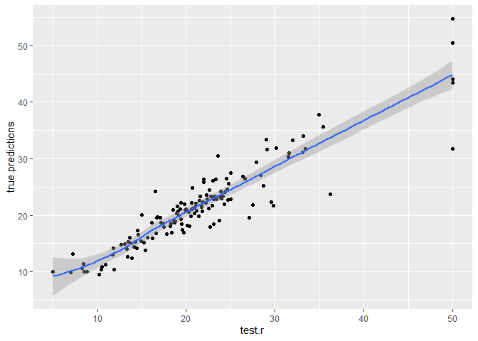
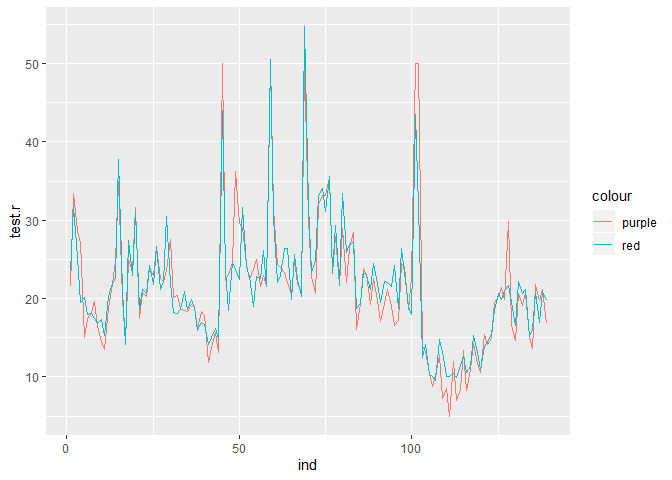
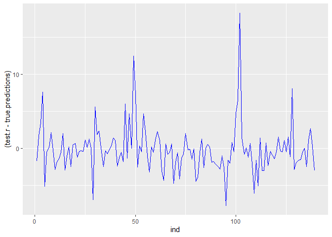

Insert Title
================
Holiday Tang
| Date: 2019-10-17

  - [Normalizing Data](#normalizing-data)
  - [Training the model](#training-the-model)
  - [predictions](#predictions)

``` r
library(MASS)
library(tibble)
```

    ## Warning: package 'tibble' was built under R version 3.6.1

``` r
Boston = as_tibble(Boston)
head(Boston)
```

    ## # A tibble: 6 x 14
    ##      crim    zn indus  chas   nox    rm   age   dis   rad   tax ptratio
    ##     <dbl> <dbl> <dbl> <int> <dbl> <dbl> <dbl> <dbl> <int> <dbl>   <dbl>
    ## 1 0.00632    18  2.31     0 0.538  6.58  65.2  4.09     1   296    15.3
    ## 2 0.0273      0  7.07     0 0.469  6.42  78.9  4.97     2   242    17.8
    ## 3 0.0273      0  7.07     0 0.469  7.18  61.1  4.97     2   242    17.8
    ## 4 0.0324      0  2.18     0 0.458  7.00  45.8  6.06     3   222    18.7
    ## 5 0.0690      0  2.18     0 0.458  7.15  54.2  6.06     3   222    18.7
    ## 6 0.0298      0  2.18     0 0.458  6.43  58.7  6.06     3   222    18.7
    ## # ... with 3 more variables: black <dbl>, lstat <dbl>, medv <dbl>

``` r
# checking data
anyNA(Boston)
```

    ## [1] FALSE

## Normalizing Data

  - Good practice for Neural Network
  - Otherwise, funky results, or it just won’t converge

<!-- end list -->

``` r
# Grabbing minimum and maximum values of columns
maxs = apply(Boston, MARGIN = 2, max)
mins = apply(Boston, MARGIN = 2, min)

# scale returns a numeric matrix, need to transform back to tibble
# center = x -> each column is gonna have x subtracted from it
# scale = x -> each column is gonna be divided by the scale 

scaled_data = scale(Boston, center = mins, scale = maxs - mins)
scaled_data = as_tibble(scaled_data)
head(scaled_data)
```

    ## # A tibble: 6 x 14
    ##      crim    zn  indus  chas   nox    rm   age   dis    rad    tax ptratio
    ##     <dbl> <dbl>  <dbl> <dbl> <dbl> <dbl> <dbl> <dbl>  <dbl>  <dbl>   <dbl>
    ## 1 0.       0.18 0.0678     0 0.315 0.578 0.642 0.269 0      0.208    0.287
    ## 2 2.36e-4  0    0.242      0 0.173 0.548 0.783 0.349 0.0435 0.105    0.553
    ## 3 2.36e-4  0    0.242      0 0.173 0.694 0.599 0.349 0.0435 0.105    0.553
    ## 4 2.93e-4  0    0.0630     0 0.150 0.659 0.442 0.449 0.0870 0.0668   0.649
    ## 5 7.05e-4  0    0.0630     0 0.150 0.687 0.528 0.449 0.0870 0.0668   0.649
    ## 6 2.64e-4  0    0.0630     0 0.150 0.550 0.575 0.449 0.0870 0.0668   0.649
    ## # ... with 3 more variables: black <dbl>, lstat <dbl>, medv <dbl>

``` r
# Splitting Data
library(caTools)
```

    ## Warning: package 'caTools' was built under R version 3.6.1

``` r
split = sample.split(scaled_data$medv, SplitRatio = 0.7)
train = subset(scaled_data, split == TRUE)
test = subset(scaled_data, split == FALSE)

head(train)
```

    ## # A tibble: 6 x 14
    ##      crim    zn  indus  chas   nox    rm   age   dis    rad    tax ptratio
    ##     <dbl> <dbl>  <dbl> <dbl> <dbl> <dbl> <dbl> <dbl>  <dbl>  <dbl>   <dbl>
    ## 1 0.      0.18  0.0678     0 0.315 0.578 0.642 0.269 0      0.208    0.287
    ## 2 2.36e-4 0     0.242      0 0.173 0.694 0.599 0.349 0.0435 0.105    0.553
    ## 3 7.05e-4 0     0.0630     0 0.150 0.687 0.528 0.449 0.0870 0.0668   0.649
    ## 4 9.21e-4 0.125 0.272      0 0.286 0.470 0.656 0.403 0.174  0.237    0.277
    ## 5 2.30e-3 0.125 0.272      0 0.286 0.397 1     0.450 0.174  0.237    0.277
    ## 6 1.84e-3 0.125 0.272      0 0.286 0.468 0.855 0.497 0.174  0.237    0.277
    ## # ... with 3 more variables: black <dbl>, lstat <dbl>, medv <dbl>

## Training the model

``` r
require(neuralnet)
```

    ## Loading required package: neuralnet

    ## Warning: package 'neuralnet' was built under R version 3.6.1

``` r
# extracting column names
n = names(train)
f = as.formula(paste("medv ~ ", paste(n[!n %in% "medv"], collapse = " + ")))

# training model
nn = neuralnet(f, data = train, hidden = c(5,3), linear.output = TRUE)

# linear.output = TRUE for numeric prediction
# linear.output = FALSE for classification

# plot out neural net
plot(nn)
```

## predictions

``` r
predicted.nn.values = compute(nn, test[1:13]) # note we use compute
str(predicted.nn.values)
```

    ## List of 2
    ##  $ neurons   :List of 3
    ##   ..$ : num [1:139, 1:14] 1 1 1 1 1 1 1 1 1 1 ...
    ##   .. ..- attr(*, "dimnames")=List of 2
    ##   .. .. ..$ : NULL
    ##   .. .. ..$ : chr [1:14] "" "crim" "zn" "indus" ...
    ##   ..$ : num [1:139, 1:6] 1 1 1 1 1 1 1 1 1 1 ...
    ##   ..$ : num [1:139, 1:4] 1 1 1 1 1 1 1 1 1 1 ...
    ##  $ net.result: num [1:139, 1] 0.407 0.594 0.45 0.323 0.336 ...

``` r
# undoing the scaling
true.predictions = predicted.nn.values$net.result * 
  (max(Boston$medv) - 
     min(Boston$medv)) + 
  min(Boston$medv) 
  

# same on the test data
test.r = test$medv * 
  (max(Boston$medv) - 
     min(Boston$medv)) + 
  min(Boston$medv) 

MSE.nn = mean((test.r - true.predictions)^2)

MSE.nn
```

    ## [1] 10.12556

``` r
# visualize
error.df = tibble(test.r, true.predictions)
head(error.df)
```

    ## # A tibble: 6 x 2
    ##   test.r true.predictions[,1]
    ##    <dbl>                <dbl>
    ## 1   21.6                 23.3
    ## 2   33.4                 31.7
    ## 3   28.7                 25.2
    ## 4   27.1                 19.5
    ## 5   15                   20.1
    ## 6   17.5                 18.0

``` r
library(ggplot2)
```

    ## Warning: package 'ggplot2' was built under R version 3.6.1

``` r
ggplot(error.df, aes(x = test.r, y = true.predictions)) + 
  geom_point() + 
  stat_smooth()
```

    ## `geom_smooth()` using method = 'loess' and formula 'y ~ x'

<!-- -->

``` r
ind = seq(1:nrow(error.df))
error.df = cbind(error.df, ind)

ggplot(error.df, aes(x = ind)) + 
  geom_line(aes(y=test.r, color = 'purple')) + 
  geom_line(aes(y=true.predictions, color = "red"))
```

<!-- -->

``` r
ggplot(error.df, aes(x = ind, y=(test.r-true.predictions))) + 
  geom_line(color = "blue")
```

<!-- -->
