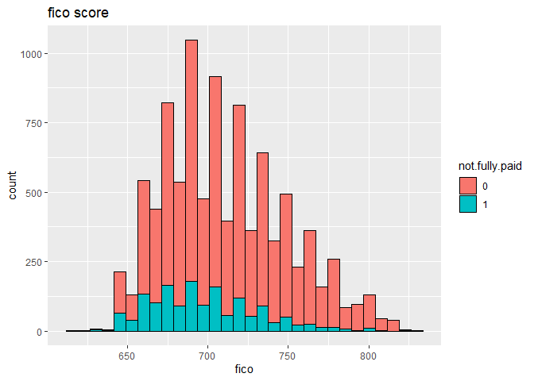
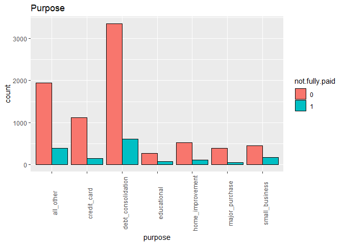
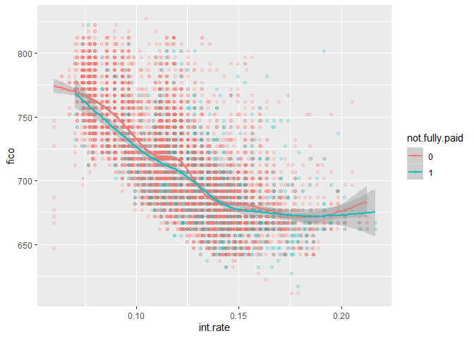

Support Vector Machine Small Project
================
Author: Holiday Tang  
[LinkeDin](https://www.linkedin.com/in/holiday-t/) |
[GitHub](https://github.com/holiday007) | [Kaggle
Novice](https://www.kaggle.com/holibae007)
| Date: 2020-01-01

  - [Project Overview Leading Club
    2016](#project-overview-leading-club-2016)
      - [Data](#data)
      - [A bit of EDA](#a-bit-of-eda)
      - [Model](#model)
      - [Tuning parameters](#tuning-parameters)

# Project Overview Leading Club 2016

Leading Club connect investors and investees

Data contains a series of variables, one of which is whether the
borrower paid back their loan in full.

**Project Goal**: Build a model that predict and classify whether a
borrow paid back in full.

Variables:

  - credit.policy: 1 if the customer meets the credit underwriting
    criteria of LendingClub.com, and 0 otherwise.
  - purpose: The purpose of the loan (takes values “credit\_card”,
    “debt\_consolidation”, “educational”, “major\_purchase”,
    “small\_business”, and “all\_other”).
  - int.rate: The interest rate of the loan, as a proportion (a rate of
    11% would be stored as 0.11). Borrowers judged by LendingClub.com to
    be more risky are assigned higher interest rates.
  - installment: The monthly installments owed by the borrower if the
    loan is funded.
  - log.annual.inc: The natural log of the self-reported annual income
    of the borrower.
  - dti: The debt-to-income ratio of the borrower (amount of debt
    divided by annual income).
  - fico: The FICO credit score of the borrower.
  - days.with.cr.line: The number of days the borrower has had a credit
    line.
  - revol.bal: The borrower’s revolving balance (amount unpaid at the
    end of the credit card billing cycle).
  - revol.util: The borrower’s revolving line utilization rate (the
    amount of the credit line used relative to total credit available).
  - inq.last.6mths: The borrower’s number of inquiries by creditors in
    the last 6 months.
  - delinq.2yrs: The number of times the borrower had been 30+ days past
    due on a payment in the past 2 years.
  - pub.rec: The borrower’s number of derogatory public records
    (bankruptcy filings, tax liens, or judgments).

### Data

##### Data Overview

**Stucture**

``` r
loans = read.csv("loan_data.csv")
str(loans)
```

    'data.frame':   9578 obs. of  14 variables:
     $ credit.policy    : int  1 1 1 1 1 1 1 1 1 1 ...
     $ purpose          : Factor w/ 7 levels "all_other","credit_card",..: 3 2 3 3 2 2 3 1 5 3 ...
     $ int.rate         : num  0.119 0.107 0.136 0.101 0.143 ...
     $ installment      : num  829 228 367 162 103 ...
     $ log.annual.inc   : num  11.4 11.1 10.4 11.4 11.3 ...
     $ dti              : num  19.5 14.3 11.6 8.1 15 ...
     $ fico             : int  737 707 682 712 667 727 667 722 682 707 ...
     $ days.with.cr.line: num  5640 2760 4710 2700 4066 ...
     $ revol.bal        : int  28854 33623 3511 33667 4740 50807 3839 24220 69909 5630 ...
     $ revol.util       : num  52.1 76.7 25.6 73.2 39.5 51 76.8 68.6 51.1 23 ...
     $ inq.last.6mths   : int  0 0 1 1 0 0 0 0 1 1 ...
     $ delinq.2yrs      : int  0 0 0 0 1 0 0 0 0 0 ...
     $ pub.rec          : int  0 0 0 0 0 0 1 0 0 0 ...
     $ not.fully.paid   : int  0 0 0 0 0 0 1 1 0 0 ...

**Summary**

``` r
summary
```

    function (object, ...) 
    UseMethod("summary")
    <bytecode: 0x0794dfe8>
    <environment: namespace:base>

Convert some variables to categorical variable

``` r
loans$credit.policy = factor(loans$credit.policy)
loans$not.fully.paid = factor(loans$not.fully.paid)
```

### A bit of EDA

``` r
library(ggplot2)
ggplot(loans, aes(fico)) + 
  geom_histogram(aes(fill = not.fully.paid), color = "black") + 
  ggtitle("fico score")
```

<!-- -->

``` r
ggplot(loans, aes(purpose)) + 
  geom_bar(aes(fill=not.fully.paid), position = "dodge", color="black") + 
  ggtitle("Purpose") + 
  theme(axis.text.x=element_text(angle = 90))
```

<!-- -->

``` r
ggplot(loans, aes(x=int.rate, y=fico, color=not.fully.paid)) +
  geom_point(alpha = 0.2) + 
  geom_smooth()
```

<!-- -->

``` r
  ggtitle("Interest Rate vs. FICO Credit Score")
```

    $title
    [1] "Interest Rate vs. FICO Credit Score"
    
    attr(,"class")
    [1] "labels"

Higher interest rate for lower credit score, makes sense.

### Model

Train-test split

``` r
library(caTools)

Split = sample.split(loans$not.fully.paid, SplitRatio = 0.7)
train = subset(loans, Split == T)
test = subset(loans, Split == F)
```

``` r
library(e1071)
SVM = svm(not.fully.paid ~., data = train)
summary(SVM)
```

``` 

Call:
svm(formula = not.fully.paid ~ ., data = train)


Parameters:
   SVM-Type:  C-classification 
 SVM-Kernel:  radial 
       cost:  1 

Number of Support Vectors:  2850

 ( 1777 1073 )


Number of Classes:  2 

Levels: 
 0 1
```

Prediction

``` r
pred.values = predict(SVM, test)
table(pred.values, test$not.fully.paid)
```

``` 
           
pred.values    0    1
          0 2413  459
          1    0    1
```

Very high false negative rate. Not paid back predicted as paid back.

### Tuning parameters

cost & gamma

``` r
tune.result = tune(svm, train.x = not.fully.paid ~ ., data = train,
                   kernel = 'radial', 
                   ranges = list(cost=c(0.1,0.5,1,2),
                                gamma=c(0.1,0.25,0.75,1)))
```

``` r
tune.result
```

Takes forever to run, so I didn’t include the process, but the outcome
is cost = 1, and gamma = 0.75 for the values I tested

Final model:

``` r
final.model = svm(not.fully.paid ~ ., cost = 1, gamma = 0.75, data = train)
```

Prediction by final model

``` r
final.pred = predict(final.model, test)
table(final.pred, test$not.fully.paid)
```

``` 
          
final.pred    0    1
         0 2412  460
         1    1    0
```

Still very bad performance lol, better tune other values or use other
models.
