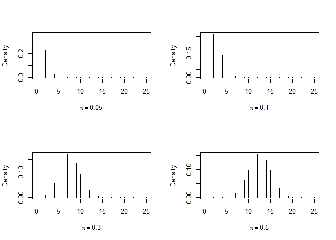
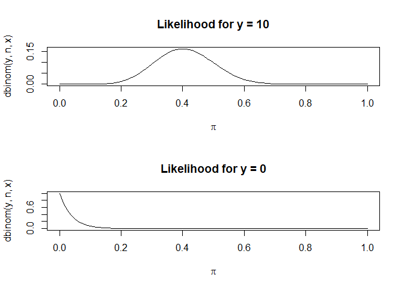

Insert Title
================
Author: Holiday Tang  
[LinkeDin](https://www.linkedin.com/in/holiday-t/) |
[GitHub](https://github.com/holiday007) | [Kaggle
Novice](https://www.kaggle.com/holibae007)
| Date: 2019-12-02

  - [Binomial inference](#binomial-inference)
      - [shapes of binomial densities](#shapes-of-binomial-densities)
      - [Shapes of likelihood for
        binomial](#shapes-of-likelihood-for-binomial)
      - [Wald CI for pi](#wald-ci-for-pi)
      - [Likelihood-ratio CI](#likelihood-ratio-ci)
      - [Score CI](#score-ci)
      - [Clopper-Pearson “exact” CI](#clopper-pearson-exact-ci)
      - [Likelihood-ratio tests](#likelihood-ratio-tests)
      - [Pearson chi-squared test](#pearson-chi-squared-test)

Materials adopted from *Introduction to Categorical Analysis* by Alan
Agresti

## Binomial inference

### shapes of binomial densities

``` r
n = 25 # # of trials
pi = c(0.05, .1, .3, .5) # probability of success
par(mfrow=c(2,2))

for(i in 1:length(pi))
  plot(0:n, dbinom(0:n,n,pi[i]), type="h",
  xlab=bquote(pi == .(pi[i])), ylab="Density")
```

<!-- -->

``` r
# bquote(abc = .b ~ cba = .q) 
# ".b", ".q" are referencing variable b and q, "abc", "cba", "=" are printed
# literally, also greek letters are letters here
```

### Shapes of likelihood for binomial

``` r
par(mfrow=c(2,1))
y <- 10
curve(dbinom(y,n,x), xlim=c(0,1), xlab=expression(pi),
 main=paste("Likelihood for y =",y))

y <- 0
curve(dbinom(y,n,x), xlim=c(0,1), xlab=expression(pi),
 main=paste("Likelihood for y =",y))
```

<!-- -->

``` r
# expression(pi) - gives greek version
```

### Wald CI for pi

``` r
y <- 10
pihat <- y/n
pihat + c(-1,1) * qnorm(1-0.05/2) * sqrt(pihat*(1-pihat)/n)
```

    [1] 0.2079635 0.5920365

``` r
y <- 0
pihat <- y/n
pihat + c(-1,1) * qnorm(1-0.05/2) * sqrt(pihat*(1-pihat)/n)
```

    [1] 0 0

### Likelihood-ratio CI

``` r
y <- 0
c(0, 1 - exp(-qchisq(1-0.05,1)/(2*n)))
```

    [1] 0.00000000 0.07395197

### Score CI

``` r
prop.test(y, n, correct=FALSE)$conf.int
```

    [1] 0.0000000 0.1331923
    attr(,"conf.level")
    [1] 0.95

``` r
# with continuity correction
prop.test(y, n)$conf.int
```

    [1] 0.000000 0.165773
    attr(,"conf.level")
    [1] 0.95

### Clopper-Pearson “exact” CI

``` r
binom.test(y, n)$conf.int
```

    [1] 0.0000000 0.1371852
    attr(,"conf.level")
    [1] 0.95

### Likelihood-ratio tests

``` r
obs <- c(26,7,9,6,4,1,2,5,0)
expected <- sum(obs) * log10(1 + 1/1:9)
( G.squared <- 2 * sum(obs * ifelse(obs>0,log(obs/expected),0)) )
```

    [1] 15.35531

### Pearson chi-squared test

``` r
chisq.test(x=c(26,7,9,6,4,1,2,5,0), p=log10(1 + 1/1:9))
```

``` 

    Chi-squared test for given probabilities

data:  c(26, 7, 9, 6, 4, 1, 2, 5, 0)
X-squared = 11.973, df = 8, p-value = 0.1524
```
