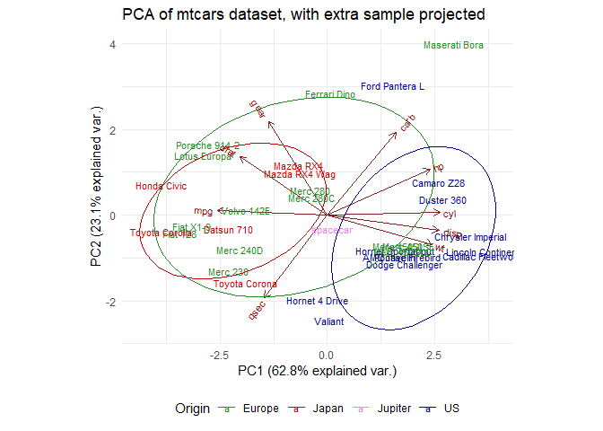

Insert Title
================
Holiday Tang
| Date: 2019-10-18

  - [Performing PCA](#performing-pca)
  - [Visualizing PCA using biplot](#visualizing-pca-using-biplot)
      - [Label](#label)
      - [Grouping the observations by
        countries](#grouping-the-observations-by-countries)
      - [Other PCs](#other-pcs)
      - [Customizing the plot](#customizing-the-plot)

Source: [Data Camp
Article](https://www.datacamp.com/community/tutorials/pca-analysis-r)

Data used = `mtcars` built in to R

# Performing PCA

``` r
mtcars.pca = prcomp(mtcars[, c(1:7, 10, 11)], center = T, scale. = T)
summary(mtcars.pca)
```

    Importance of components:
                              PC1    PC2     PC3     PC4     PC5     PC6
    Standard deviation     2.3782 1.4429 0.71008 0.51481 0.42797 0.35184
    Proportion of Variance 0.6284 0.2313 0.05602 0.02945 0.02035 0.01375
    Cumulative Proportion  0.6284 0.8598 0.91581 0.94525 0.96560 0.97936
                               PC7    PC8     PC9
    Standard deviation     0.32413 0.2419 0.14896
    Proportion of Variance 0.01167 0.0065 0.00247
    Cumulative Proportion  0.99103 0.9975 1.00000

Proportion of variance refer to the extent, or percentage of variance
explained by the PC.

``` r
str(mtcars.pca)
```

    List of 5
     $ sdev    : num [1:9] 2.378 1.443 0.71 0.515 0.428 ...
     $ rotation: num [1:9, 1:9] -0.393 0.403 0.397 0.367 -0.312 ...
      ..- attr(*, "dimnames")=List of 2
      .. ..$ : chr [1:9] "mpg" "cyl" "disp" "hp" ...
      .. ..$ : chr [1:9] "PC1" "PC2" "PC3" "PC4" ...
     $ center  : Named num [1:9] 20.09 6.19 230.72 146.69 3.6 ...
      ..- attr(*, "names")= chr [1:9] "mpg" "cyl" "disp" "hp" ...
     $ scale   : Named num [1:9] 6.027 1.786 123.939 68.563 0.535 ...
      ..- attr(*, "names")= chr [1:9] "mpg" "cyl" "disp" "hp" ...
     $ x       : num [1:32, 1:9] -0.664 -0.637 -2.3 -0.215 1.587 ...
      ..- attr(*, "dimnames")=List of 2
      .. ..$ : chr [1:32] "Mazda RX4" "Mazda RX4 Wag" "Datsun 710" "Hornet 4 Drive" ...
      .. ..$ : chr [1:9] "PC1" "PC2" "PC3" "PC4" ...
     - attr(*, "class")= chr "prcomp"

  - rotation: The relationship (correlation or anticorrelation, etc)
    between the initial variables and the principal components

  - x: The values of each sample in terms of the principal components
    ($x)

# Visualizing PCA using biplot

``` r
library(ggbiplot)

ggbiplot(mtcars.pca) + labs(x="PC1 (62.8%)", y="PC2 (23.1%)")
```

<!-- -->

## Label

``` r
ggbiplot(mtcars.pca, labels = rownames(mtcars))
```

<!-- -->

By the clustering pattern, you can see what moedels of cars are similar
to one another.

## Grouping the observations by countries

``` r
mtcars.country = c(rep("Japan", 3), rep("US",4), rep("Europe", 7),rep("US",3), "Europe", rep("Japan", 3), rep("US",4), rep("Europe", 3), "US", rep("Europe", 3))

ggbiplot(mtcars.pca, labels = rownames(mtcars), groups = mtcars.country, ellipse = T)
```

<!-- -->

  - American cars are characterized by high `cyl`, `disp`, and `wt`,
    while Japanese care are characterized by high `mpg`

## Other PCs

``` r
ggbiplot(mtcars.pca, labels=rownames(mtcars), groups=mtcars.country, choices = 3:4, ellipse = T)
```

<!-- -->

## Customizing the plot

``` r
ggbiplot(mtcars.pca,ellipse=TRUE,obs.scale = 1, var.scale = 1,
         labels=rownames(mtcars), groups=mtcars.country) + 
  scale_color_manual(name="Origin", values = c("forest green",
                                               "red3", 
                                               "dark blue")) + 
  theme_bw() + 
  theme(legend.position = "bottom")
```

<!-- -->

Note:

  - Extreme outlier have experme effects on PCA

Example - let’s add a extreme sample

``` r
spacecar <- c(1000,60,50,500,0,0.5,2.5,0,1,0,0)

mtcarsplus <- rbind(mtcars, spacecar)
mtcars.countryplus <- c(mtcars.country, "Jupiter")


mtcarsplus.pca <- prcomp(mtcarsplus[,c(1:7,10,11)], center = TRUE,scale. = TRUE)

ggbiplot(mtcarsplus.pca, obs.scale = 1, var.scale = 1, ellipse = TRUE, circle = FALSE, var.axes=TRUE, labels=c(rownames(mtcars), "spacecar"), groups=mtcars.countryplus)+
  scale_colour_manual(name="Origin", values= c("forest green", "red3", "violet", "dark blue"))+
  ggtitle("PCA of mtcars dataset, with extra sample added")+
  theme_minimal()+
  theme(legend.position = "bottom")
```

<!-- -->

If you want to see how the new sample compares to the groups produced by
the initial PCA, you need to project it onto that PCA.

What this means is that the principal components are defined without
relation to your spacecar sample, then you compute where spacecar is
placed in relation to the other samples by applying the transformations
that your PCA has produced.

1.  scale the values for spacecar in relation to the PCA’s center
    (`mtcars.pca$center`)

2.  apply the rotation of the PCA matrix to the spacecar sampl3

3.  `rbind()` the projected values for `spacecar` to the rest of the
    `pca$x`

<!-- end list -->

``` r
s.sc = scale(t(spacecar[c(1:7, 10:11)]), center=mtcars.pca$center)
s.pred = s.sc %*% mtcars.pca$rotation

mtcars.plusproj.pca <- mtcars.pca
mtcars.plusproj.pca$x <- rbind(mtcars.plusproj.pca$x, s.pred)

ggbiplot(mtcars.plusproj.pca, obs.scale = 1, var.scale = 1, ellipse = TRUE, circle = FALSE, var.axes=TRUE, labels=c(rownames(mtcars), "spacecar"), groups=mtcars.countryplus)+
  scale_colour_manual(name="Origin", values= c("forest green", "red3", "violet", "dark blue"))+
  ggtitle("PCA of mtcars dataset, with extra sample projected")+
  theme_minimal()+
  theme(legend.position = "bottom")
```

<!-- -->

`Spacecar` is no longer skewing the PCA, but it is drastically different
from every other model or group

  - performing both PCA and PCA projection can be helpful EDA efforts
