ggplot2
================
Author: Holiday Tang  
[LinkeDin](https://www.linkedin.com/in/holiday-t/) |
[GitHub](https://github.com/holiday007) | [Kaggle
Novice](https://www.kaggle.com/holibae007)
| Date: 2019-12-04

  - [Replicating exercise from](#replicating-exercise-from)
  - [elements of ggplot2](#elements-of-ggplot2)
  - [Working with Axes](#working-with-axes)
  - [Titles](#titles)

### Replicating exercise from

\[\]
(<https://cedricscherer.netlify.com/2019/08/05/a-ggplot2-tutorial-for-beautiful-plotting-in-r/>)

``` r
packs = c("ggplot2", "ggthemes", "tidyverse", "extrafont", 
          "cowplot", "grid", "gridExtra", "ggrepel", 
          "reshape2", "ggforce", "ggridges", "shiny", "patchwork",
          "readr", "tidyverse", "extrafont")

for (i in length(packs)){
  if(!require(packs[i], quietly = TRUE)) install.packages(packs[i])
}
```

``` r
chic = readr::read_csv("https://raw.githubusercontent.com/Z3tt/R-Tutorials/master/ggplot2/chicago-nmmaps.csv")

tibble::glimpse(chic)
```

    ## Observations: 1,461
    ## Variables: 10
    ## $ city     <chr> "chic", "chic", "chic", "chic", "chic", "chic", "chic...
    ## $ date     <date> 1997-01-01, 1997-01-02, 1997-01-03, 1997-01-04, 1997...
    ## $ death    <dbl> 137, 123, 127, 146, 102, 127, 116, 118, 148, 121, 110...
    ## $ temp     <dbl> 36.0, 45.0, 40.0, 51.5, 27.0, 17.0, 16.0, 19.0, 26.0,...
    ## $ dewpoint <dbl> 37.500, 47.250, 38.000, 45.500, 11.250, 5.750, 7.000,...
    ## $ pm10     <dbl> 13.052268, 41.948600, 27.041751, 25.072573, 15.343121...
    ## $ o3       <dbl> 5.659256, 5.525417, 6.288548, 7.537758, 20.760798, 14...
    ## $ time     <dbl> 3654, 3655, 3656, 3657, 3658, 3659, 3660, 3661, 3662,...
    ## $ season   <chr> "Winter", "Winter", "Winter", "Winter", "Winter", "Wi...
    ## $ year     <dbl> 1997, 1997, 1997, 1997, 1997, 1997, 1997, 1997, 1997,...

``` r
head(chic, 10)
```

    ## # A tibble: 10 x 10
    ##    city  date       death  temp dewpoint  pm10    o3  time season  year
    ##    <chr> <date>     <dbl> <dbl>    <dbl> <dbl> <dbl> <dbl> <chr>  <dbl>
    ##  1 chic  1997-01-01   137  36      37.5  13.1   5.66  3654 Winter  1997
    ##  2 chic  1997-01-02   123  45      47.2  41.9   5.53  3655 Winter  1997
    ##  3 chic  1997-01-03   127  40      38    27.0   6.29  3656 Winter  1997
    ##  4 chic  1997-01-04   146  51.5    45.5  25.1   7.54  3657 Winter  1997
    ##  5 chic  1997-01-05   102  27      11.2  15.3  20.8   3658 Winter  1997
    ##  6 chic  1997-01-06   127  17       5.75  9.36 14.9   3659 Winter  1997
    ##  7 chic  1997-01-07   116  16       7    20.2  11.9   3660 Winter  1997
    ##  8 chic  1997-01-08   118  19      17.8  33.1   8.68  3661 Winter  1997
    ##  9 chic  1997-01-09   148  26      24    12.1  13.4   3662 Winter  1997
    ## 10 chic  1997-01-10   121  16       5.38 24.8  10.4   3663 Winter  1997

### elements of ggplot2

  - Data
  - Geometries - `geom_`: geometric shape that represents the data
  - Aesthetics - `aes()`: Aesthetics of the geometric and statistical
    objects, such as color, size, shape, transparency and position
  - Scales `scale_`: Maps between the data and the aesthetic dimensions,
    such as data range to plot width or factor values to colors.
  - Statistical transformations `stat_`: Statistical summaries of the
    data, such as quantiles, fitted curves and sums.
  - Coordinate system `coord_`: The transformation used for mapping data
    coordinates into the plane of the data rectangle.
  - Facets `facet_`: The arrangement of the data into a grid of plots.
  - Visual themes `theme()`: The overall visual defaults of a plot, such
    as background, grids, axes, default typeface, sizes and colors.

<!-- end list -->

``` r
# library(ggplot2)
library(tidyverse)
```

    ## -- Attaching packages -------------------- tidyverse 1.2.1 --

    ## v ggplot2 3.2.1     v purrr   0.3.2
    ## v tibble  2.1.3     v dplyr   0.8.3
    ## v tidyr   1.0.0     v stringr 1.4.0
    ## v readr   1.3.1     v forcats 0.4.0

    ## -- Conflicts ----------------------- tidyverse_conflicts() --
    ## x dplyr::filter() masks stats::filter()
    ## x dplyr::lag()    masks stats::lag()

``` r
# start by defining a plot element
# ggplot(data = df, aes(x = , y = ,))

(g = ggplot(chic, aes(x=date, y=temp))) 
```

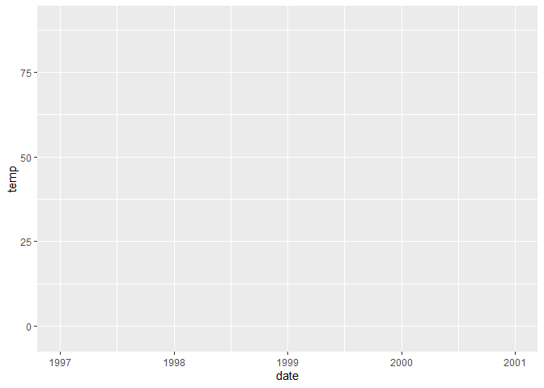<!-- -->

``` r
#using parentheses while creating an object the object will be printed immediately 
```

#### Scatterplot

``` r
g + geom_point() # scatterplot
```

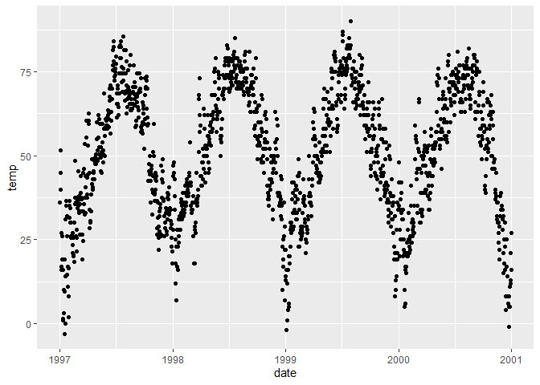<!-- -->

``` r
g + geom_point(color = 'purple')
```

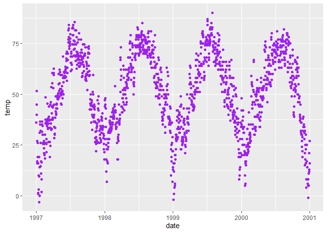<!-- -->

##### Setting theme

``` r
theme_set(theme_bw())

g + geom_point(color = 'purple')
```

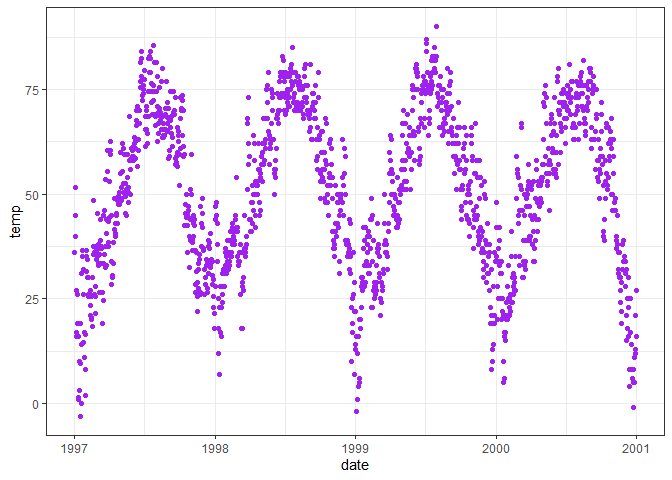<!-- -->

### Working with Axes

#### Add Axis Labels

  - Temperature - degree \~ F

<!-- end list -->

``` r
ggplot(chic, aes(x=date, y=temp)) +
  geom_point(color='purple') + 
  labs(x='Year', y=expression(paste('Temperature (', degree ~ F, ')')))
```

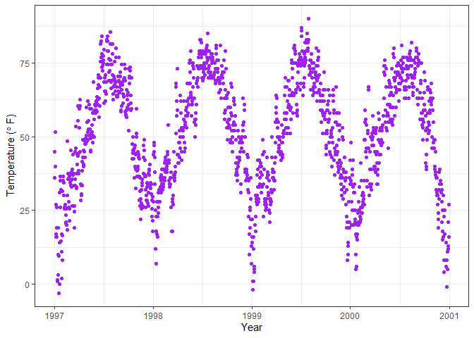<!-- -->

#### Manipulating Labels

  - `theme()` - all kinds of elements
    ()\[<https://ggplot2.tidyverse.org/reference/theme.html>\]

<!-- end list -->

``` r
ggplot(chic, aes(x=date, y=temp)) +
  geom_point(color = 'purple') + 
  labs(x='Year', y='Temperature (°F)') + 
  theme(axis.title.x = element_text(color = 'red', size = 15, vjust = 1),
        axis.title.y = element_text(color = 'blue', size = 15, vjust = 1))
```

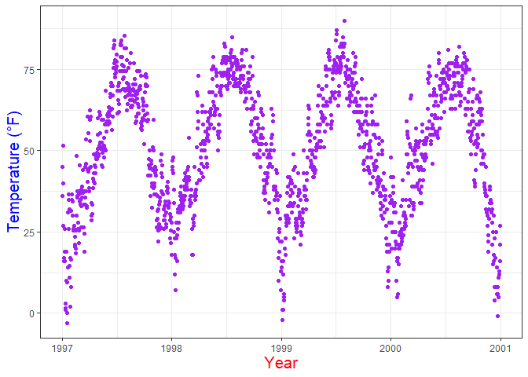<!-- -->

  - `angle`, `vjust` - adjust position of the text

<!-- end list -->

``` r
ggplot(chic, aes(x=date, y=temp)) +
  geom_point(color='purple') +
  labs(x="Year", y="Temperature (°F)") + 
  theme(axis.text.x = element_text(angle = 45, size = 15, vjust = 0.5))
```

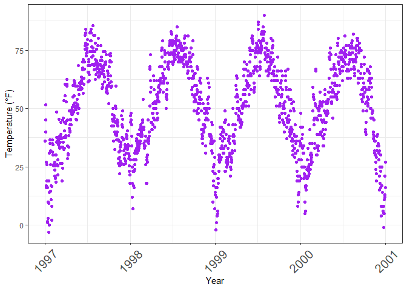<!-- -->

#### Remove Axis Ticks & Tick Text

\*`element_blank()` - magic of getting rid of something

``` r
ggplot(chic, aes(x=date, y=temp)) + 
  geom_point(color="purple") + 
  labs(x="Year", y="Temperature (°F)") + 
  theme(axis.ticks.y = element_blank(),
        axis.text.y = element_blank())
```

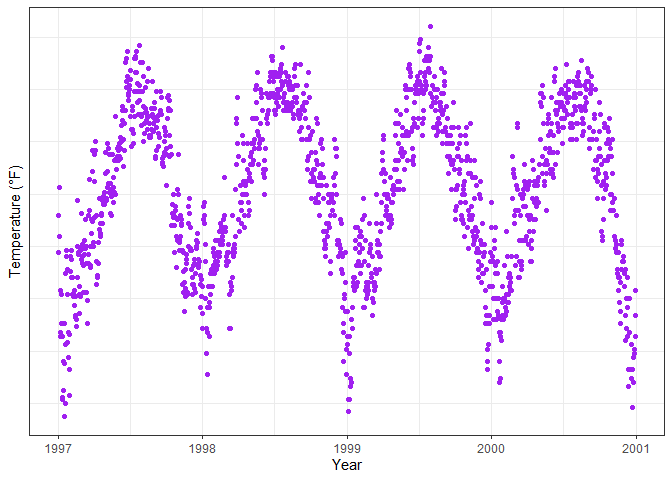<!-- -->

#### Limit Axis Range

``` r
ggplot(chic, aes(x=date, y=temp)) + 
  geom_point(color="purple") + 
  labs(x="Year", y="Temperature (°F)") +
  ylim(c(0,50))
```

    ## Warning: Removed 777 rows containing missing values (geom_point).

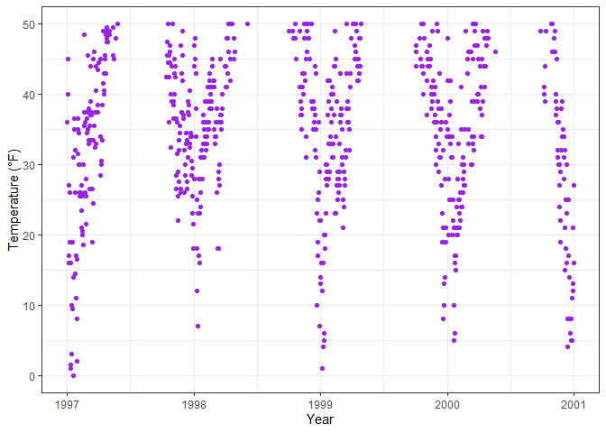<!-- -->

Alternative:

  - `g + scale_x_continuous(limits = c(0, 50))`: remove out-of-range
    points
  - `g + coord_cartesian(xlim = c(0, 50))` : adjust visible area

#### Force plot to start at origin

``` r
chic %>%
  dplyr::filter(temp>25, o3>20) %>%
  ggplot(aes(x=temp, y=o3)) + 
  geom_point(color = "pink") + 
  labs(x=expression(paste("Temperature higher than 25", degree ~ F, "")), y="Ozone higher than 20 ppb") + 
  expand_limits(x=0, y=0)
```

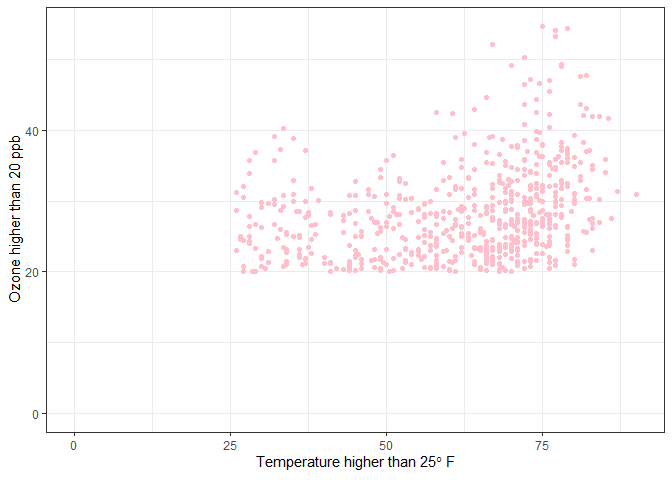<!-- -->

Alternative: `coord_cartesian(xlim = c(0, max(chic_red$temp)), ylim =
c(0, max(chic_red$o3)))`

``` r
ggplot(chic, aes(x=temp, y=temp + rnorm(nrow(chic), sd=20))) + 
  geom_point() + 
  xlim(c(0,100)) + ylim(c(0,150)) +
  coord_equal()
```

    ## Warning: Removed 46 rows containing missing values (geom_point).

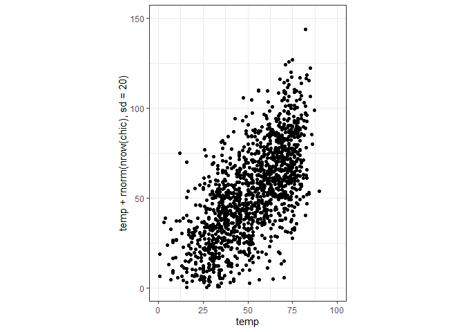<!-- -->

#### Altering Labels by Function

``` r
ggplot(chic, aes(x=date, y=temp)) + 
  geom_point(color="purple") + 
  labs(x="Year", y="Temperature (°F)") + 
  scale_y_continuous(labels = function(x) {return(paste(x, "Degrees Fahrenheit"))})
```

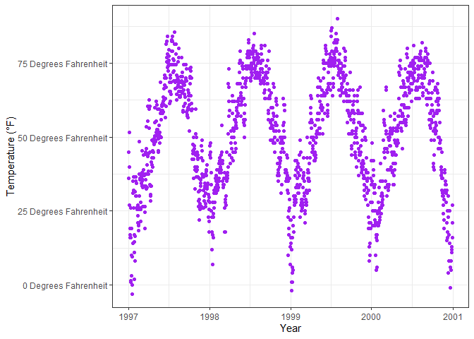<!-- -->

### Titles

  - `ggtitle()`

<!-- end list -->

``` r
ggplot(chic, aes(x=date, y=temp)) + 
  geom_point(color="purple") + 
  labs(x="Year", y="Temperature (°F)") + 
  ggtitle("Temperatures in Chicago") 
```

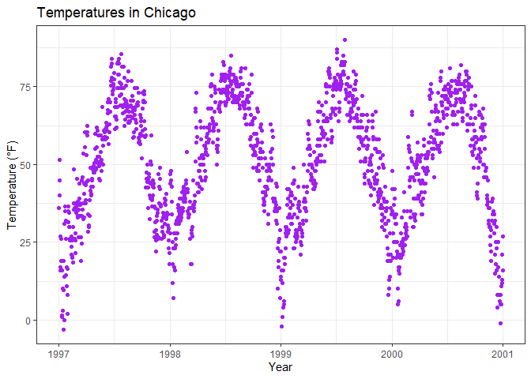<!-- -->

  - `lab(title = , subtitle = , caption = )`

<!-- end list -->

``` r
ggplot(chic, aes(x = date, y = temp)) +
  geom_point(color = "firebrick") + 
  labs(x = "Year", y = "Temperature (°F)",
       title = "Temperatures in Chicago",
       subtitle = "Seasonal patter of daily temperatures from 1997 to 2001",
       caption = "Data:NMAPS"
  )
```

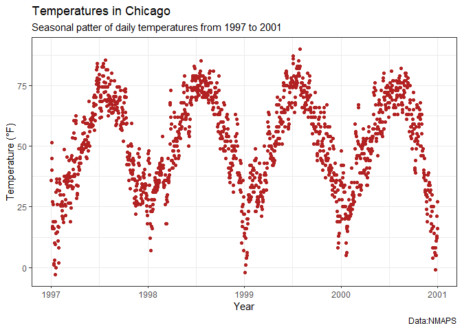<!-- -->

#### Title Manipulation

  - Make Title Bold and Add Space at Baseline

<!-- end list -->

``` r
ggplot(chic, aes(x = date, y = temp)) +
  geom_point(color = "firebrick") + 
  labs(x = "Year", y = "Temperature (°F)", 
       title = "Temperatures in Chicago") +
  theme(plot.title = element_text(size=15, face="bold", 
                                  margin = margin(10,0,8,0)))
```

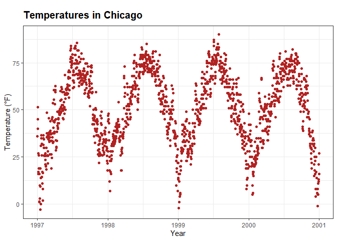<!-- -->

##### Position of Title

``` r
ggplot(chic, aes(x = date, y = temp)) +
  geom_point(color = "firebrick") +  
  labs(x = "Year", y = "Temperature (°F)", 
       title = "Temperatures in Chicago") + 
  theme(plot.title = element_text(size = 15, face = 9, hjust = 0.5))
```

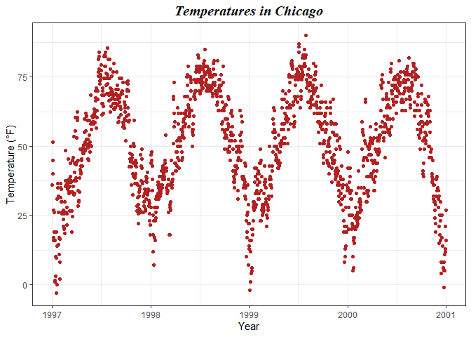<!-- -->

#### Fonts

  - `extrafont::font_import()`  
  - `element_text(..., family = ...)`

<!-- end list -->

``` r
library(extrafont)
```

    ## Registering fonts with R

``` r
font_import()
```

    ## Importing fonts may take a few minutes, depending on the number of fonts and the speed of the system.
    ## Continue? [y/n]

    ## Exiting.

``` r
fonts()
```

    ##   [1] "Agency FB"                       "Algerian"                       
    ##   [3] "Arial Black"                     "Arial"                          
    ##   [5] "Arial Narrow"                    "Arial Rounded MT Bold"          
    ##   [7] "Bahnschrift"                     "Baskerville Old Face"           
    ##   [9] "Bauhaus 93"                      "Bell MT"                        
    ##  [11] "Berlin Sans FB"                  "Berlin Sans FB Demi"            
    ##  [13] "Bernard MT Condensed"            "Blackadder ITC"                 
    ##  [15] "Bodoni MT"                       "Bodoni MT Black"                
    ##  [17] "Bodoni MT Condensed"             "Bodoni MT Poster Compressed"    
    ##  [19] "Book Antiqua"                    "Bookman Old Style"              
    ##  [21] "Bookshelf Symbol 7"              "Bradley Hand ITC"               
    ##  [23] "Britannic Bold"                  "Broadway"                       
    ##  [25] "Brush Script MT"                 "Calibri"                        
    ##  [27] "Calibri Light"                   "Californian FB"                 
    ##  [29] "Calisto MT"                      "Cambria"                        
    ##  [31] "Candara"                         "Candara Light"                  
    ##  [33] "Castellar"                       "Centaur"                        
    ##  [35] "Century"                         "Century Gothic"                 
    ##  [37] "Century Schoolbook"              "Chiller"                        
    ##  [39] "Colonna MT"                      "Comic Sans MS"                  
    ##  [41] "Consolas"                        "Constantia"                     
    ##  [43] "Cooper Black"                    "Copperplate Gothic Bold"        
    ##  [45] "Copperplate Gothic Light"        "Corbel"                         
    ##  [47] "Corbel Light"                    "Courier New"                    
    ##  [49] "Curlz MT"                        "DejaVu Sans Mono"               
    ##  [51] "DengXian"                        "DengXian Light"                 
    ##  [53] "Dubai"                           "Dubai Light"                    
    ##  [55] "Dubai Medium"                    "Ebrima"                         
    ##  [57] "Edwardian Script ITC"            "Elephant"                       
    ##  [59] "Engravers MT"                    "Eras Bold ITC"                  
    ##  [61] "Eras Demi ITC"                   "Eras Light ITC"                 
    ##  [63] "Eras Medium ITC"                 "ESRI AMFM Electric"             
    ##  [65] "ESRI AMFM Gas"                   "ESRI AMFM Sewer"                
    ##  [67] "ESRI AMFM Water"                 "ESRI ArcPad"                    
    ##  [69] "ESRI Arrowhead"                  "ESRI Business"                  
    ##  [71] "ESRI Cartography"                "ESRI Caves 1"                   
    ##  [73] "ESRI Caves 2"                    "ESRI Caves 3"                   
    ##  [75] "ESRI Climate & Precipitation"    "ESRI Commodities"               
    ##  [77] "ESRI Conservation"               "ESRI Crime Analysis"            
    ##  [79] "ESRI Default Marker"             "ESRI Dimensioning"              
    ##  [81] "ESRI Elements"                   "ESRI Enviro Hazard Analysis"    
    ##  [83] "ESRI Enviro Hazard Incident"     "ESRI Enviro Hazard Sites"       
    ##  [85] "ESRI Environmental & Icons"      "ESRI ERS Infrastructures S1"    
    ##  [87] "ESRI ERS Operations S1"          "ESRI Fire Incident NFPA"        
    ##  [89] "ESRI Geology"                    "ESRI Geology AGSO 1"            
    ##  [91] "ESRI Geology USGS 95-525"        "ESRI Geometric Symbols"         
    ##  [93] "ESRI Hazardous Materials"        "ESRI Hydrants"                  
    ##  [95] "ESRI IGL Font16"                 "ESRI IGL Font20"                
    ##  [97] "ESRI IGL Font21"                 "ESRI IGL Font22"                
    ##  [99] "ESRI IGL Font23"                 "ESRI IGL Font24"                
    ## [101] "ESRI IGL Font25"                 "ESRI Meteorological 01"         
    ## [103] "ESRI Mil2525C Modifiers"         "ESRI MilMod 01"                 
    ## [105] "ESRI MilMod 02"                  "ESRI MilRed 01"                 
    ## [107] "ESRI MilSym 01"                  "ESRI MilSym 02"                 
    ## [109] "ESRI MilSym 03"                  "ESRI MilSym 04"                 
    ## [111] "ESRI MilSym 05"                  "ESRI NIMA City Graphic LN"      
    ## [113] "ESRI NIMA City Graphic PT"       "ESRI NIMA DNC LN"               
    ## [115] "ESRI NIMA DNC PT"                "ESRI NIMA VMAP1&2 LN"           
    ## [117] "ESRI NIMA VMAP1&2 PT"            "ESRI North"                     
    ## [119] "ESRI Oil, Gas, & Water"          "ESRI Ordnance Survey"           
    ## [121] "ESRI Pipeline US 1"              "ESRI Public1"                   
    ## [123] "ESRI SDS 1.95 1"                 "ESRI SDS 1.95 2"                
    ## [125] "ESRI SDS 2.00 1"                 "ESRI SDS 2.00 2"                
    ## [127] "ESRI Shields"                    "ESRI Surveyor"                  
    ## [129] "ESRI Telecom"                    "ESRI Transportation & Civic"    
    ## [131] "ESRI US Forestry 1"              "ESRI US MUTCD 1"                
    ## [133] "ESRI US MUTCD 2"                 "ESRI US MUTCD 3"                
    ## [135] "ESRI Weather"                    "FangSong"                       
    ## [137] "Felix Titling"                   "Footlight MT Light"             
    ## [139] "Forte"                           "Franklin Gothic Book"           
    ## [141] "Franklin Gothic Demi"            "Franklin Gothic Demi Cond"      
    ## [143] "Franklin Gothic Heavy"           "Franklin Gothic Medium"         
    ## [145] "Franklin Gothic Medium Cond"     "Freestyle Script"               
    ## [147] "French Script MT"                "Gabriola"                       
    ## [149] "Gadugi"                          "Garamond"                       
    ## [151] "Georgia"                         "Gigi"                           
    ## [153] "Gill Sans Ultra Bold"            "Gill Sans Ultra Bold Condensed" 
    ## [155] "Gill Sans MT"                    "Gill Sans MT Condensed"         
    ## [157] "Gill Sans MT Ext Condensed Bold" "Gloucester MT Extra Condensed"  
    ## [159] "Goudy Old Style"                 "Goudy Stout"                    
    ## [161] "Haettenschweiler"                "Harlow Solid Italic"            
    ## [163] "Harrington"                      "High Tower Text"                
    ## [165] "HoloLens MDL2 Assets"            "Impact"                         
    ## [167] "Imprint MT Shadow"               "Informal Roman"                 
    ## [169] "Ink Free"                        "Javanese Text"                  
    ## [171] "Jokerman"                        "Juice ITC"                      
    ## [173] "KaiTi"                           "Kristen ITC"                    
    ## [175] "Kunstler Script"                 "Wide Latin"                     
    ## [177] "Leelawadee UI"                   "Leelawadee UI Semilight"        
    ## [179] "Lucida Bright"                   "Lucida Calligraphy"             
    ## [181] "Lucida Console"                  "Lucida Fax"                     
    ## [183] "Lucida Handwriting"              "Lucida Sans"                    
    ## [185] "Lucida Sans Typewriter"          "Lucida Sans Unicode"            
    ## [187] "Magneto"                         "Maiandra GD"                    
    ## [189] "Malgun Gothic"                   "Malgun Gothic Semilight"        
    ## [191] "Marlett"                         "Matura MT Script Capitals"      
    ## [193] "Microsoft Himalaya"              "Microsoft Yi Baiti"             
    ## [195] "Microsoft New Tai Lue"           "Microsoft PhagsPa"              
    ## [197] "Microsoft Sans Serif"            "Microsoft Tai Le"               
    ## [199] "Mistral"                         "Modern No. 20"                  
    ## [201] "Mongolian Baiti"                 "Monotype Corsiva"               
    ## [203] "MS Outlook"                      "MS Reference Sans Serif"        
    ## [205] "MS Reference Specialty"          "MT Extra"                       
    ## [207] "MV Boli"                         "Myanmar Text"                   
    ## [209] "Niagara Engraved"                "Niagara Solid"                  
    ## [211] "Nirmala UI"                      "Nirmala UI Semilight"           
    ## [213] "OCR A Extended"                  "Old English Text MT"            
    ## [215] "Onyx"                            "Open Sans"                      
    ## [217] "Open Sans Extrabold"             "Open Sans Light"                
    ## [219] "Open Sans Semibold"              "Palace Script MT"               
    ## [221] "Palatino Linotype"               "Papyrus"                        
    ## [223] "Parchment"                       "Perpetua"                       
    ## [225] "Perpetua Titling MT"             "Playbill"                       
    ## [227] "Poor Richard"                    "Pristina"                       
    ## [229] "Rage Italic"                     "Ravie"                          
    ## [231] "Rockwell"                        "Rockwell Condensed"             
    ## [233] "Rockwell Extra Bold"             "Script MT Bold"                 
    ## [235] "Segoe MDL2 Assets"               "Segoe Print"                    
    ## [237] "Segoe Script"                    "Segoe UI"                       
    ## [239] "Segoe UI Light"                  "Segoe UI Semibold"              
    ## [241] "Segoe UI Semilight"              "Segoe UI Black"                 
    ## [243] "Segoe UI Emoji"                  "Segoe UI Historic"              
    ## [245] "Segoe UI Symbol"                 "Showcard Gothic"                
    ## [247] "SimHei"                          "SimSun-ExtB"                    
    ## [249] "Snap ITC"                        "Stencil"                        
    ## [251] "Sylfaen"                         "Symbol"                         
    ## [253] "Tahoma"                          "Tempus Sans ITC"                
    ## [255] "Times New Roman"                 "Trebuchet MS"                   
    ## [257] "Tw Cen MT"                       "Tw Cen MT Condensed"            
    ## [259] "Tw Cen MT Condensed Extra Bold"  "Verdana"                        
    ## [261] "Viner Hand ITC"                  "Vivaldi"                        
    ## [263] "Vladimir Script"                 "Webdings"                       
    ## [265] "Wingdings"                       "Wingdings 2"                    
    ## [267] "Wingdings 3"

``` r
ggplot(chic, aes(x=date, y=temp)) + 
  geom_point(color="purple") + 
  labs(x="Year", y="Temperature (°F)", title="Temperatures in Chicago") + 
  theme(plot.title = element_text(size=18, family = "Times New Roman"))
```

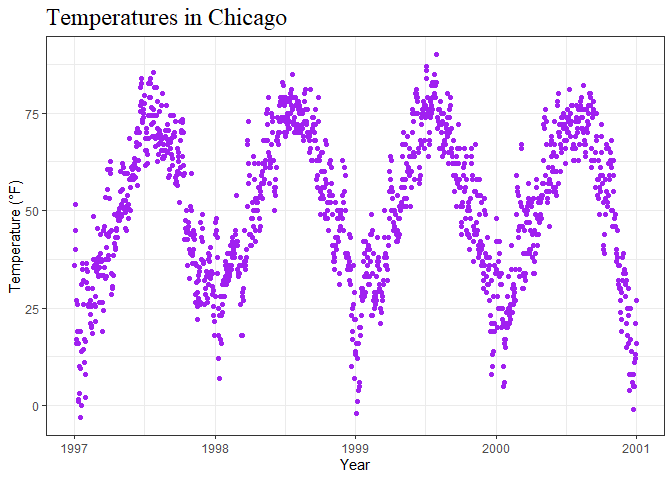<!-- -->

``` r
# setting default fonts
theme_set(theme_bw(base_size = 14, base_family = "Calibri"))
```

#### Spacing in multi-line text

``` r
ggplot(chic, aes(x=date, y=temp)) + 
  geom_point(color = "purple") + 
  labs(x="Year", y="Temperature (°F)") + 
  ggtitle("Temperatures in Chicago\nfrom 1997 to 2001") + # notice \n
  theme(plot.title = element_text(size=16, face="bold", vjust=1,
                                  lineheight = 1))
```

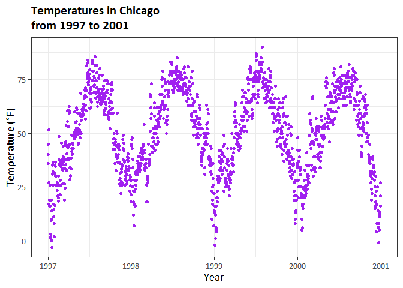<!-- -->

#### Legends

``` r
# color code based on factor
ggplot(chic, aes(x=date, y=temp)) + 
  geom_point(aes(color = factor(season))) +  # to access variable you got to
  # put it in aes function
  labs(x="Year", y="Temperature (°F)")
```

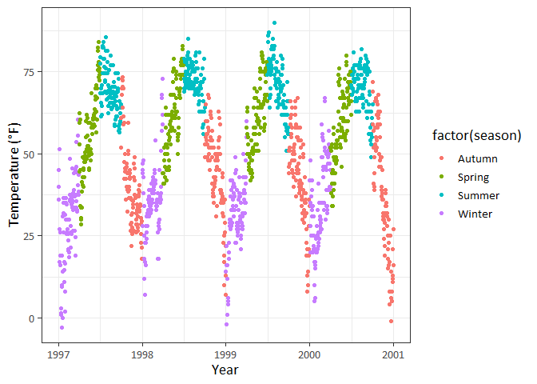<!-- -->

  - `theme(legend.position = "none")`
  - `guides(fill = F)`
  - `scale_fill_discrete(guide = F)`

<!-- end list -->

``` r
# turn off legend in theme (function)
ggplot(chic, aes(x = date, y = temp, color = factor(season))) +
  geom_point() +
  labs(x = "Year", y = "Temperature (°F)") + 
  theme(legend.position = "none")
```

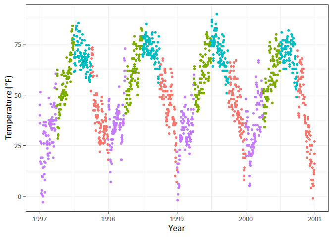<!-- -->

``` r
# turn off legen title
ggplot(chic, aes(x = date, y = temp, color = factor(season))) +
  geom_point() +
  labs(x = "Year", y = "Temperature (°F)") + 
  theme(legend.title = element_blank())
```

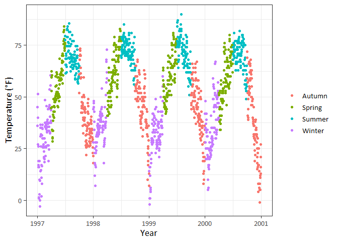<!-- -->

``` r
# legend position - top, right, bottom, left
ggplot(chic, aes(x = date, y = temp, color = factor(season))) +
  geom_point() +
  labs(x = "Year", y = "Temperature (°F)") + 
  theme(legend.position = "top", legend.title = element_blank())
```

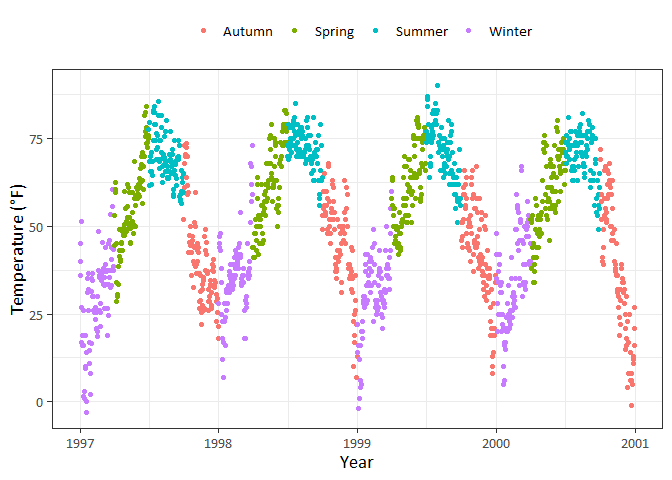<!-- -->

``` r
ggplot(chic, aes(x = date, y = temp, color = factor(season))) +
  geom_point() +
  labs(x = "Year", y = "Temperature (°F)") + 
  theme(legend.title = element_text(size=14, color="orange",
                                    face="bold"))
```

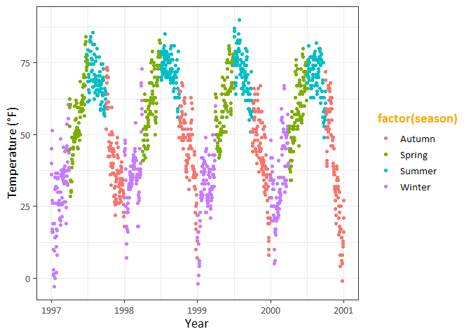<!-- -->

``` r
# change legend title
ggplot(chic, aes(x = date, y = temp, color = factor(season))) +
  geom_point() + 
  labs(x="Year", y="Temperature (°F)", color="Seasons:") 
```

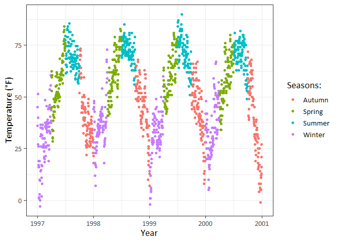<!-- -->

legend details can be changed by:

  - `scale_color_discrete`  
  - `scale_color_continuous`

<!-- end list -->

``` r
ggplot(chic, aes(x = date, y = temp, color = factor(season))) +
  geom_point() +
  labs(x = "Year", y = "Temperature (°F)") + 
  theme(legend.title = element_text(color = "chocolate", 
                                    size = 14, face = "bold")) +
  scale_color_discrete(name = "Season")
```

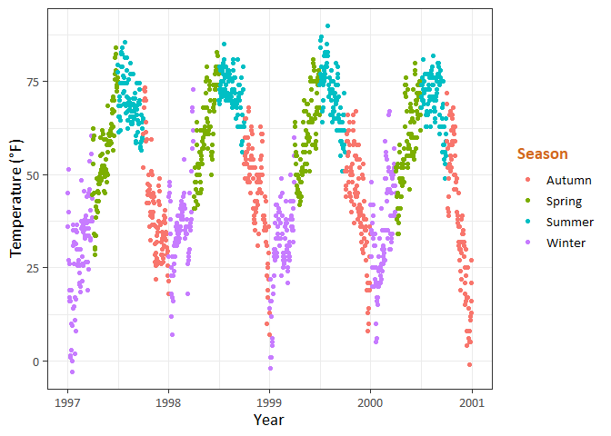<!-- -->

``` r
# change order of legend keys

#change the levels of season
chic$season = factor(chic$season, levels = c("Spring", "Summer",
                                             "Autumn", "Winter"))

ggplot(chic, aes(x=date, y=temp)) +
  geom_point(aes(color=season)) + 
  labs(x = "Year", y = "Temperature (°F)")
```

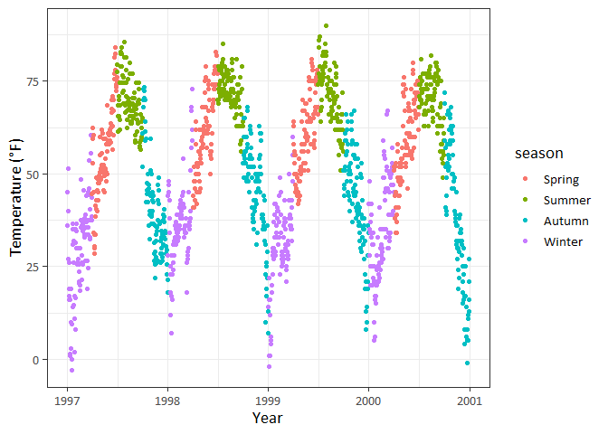<!-- -->

``` r
# change legend labels
ggplot(chic, aes(x = date, y = temp, color = season)) +
  geom_point() +
  labs(x = "Year", y = "Temperature (°F)", color = "Seasons:") + 
  theme(legend.title = element_text(color = "chocolate", 
                                    size = 14, face = 2)) + 
  scale_color_discrete(labels = c("Mar - May", "Jun - Aug", 
                                              "Sep - Nov", "Dec - Feb"))
```

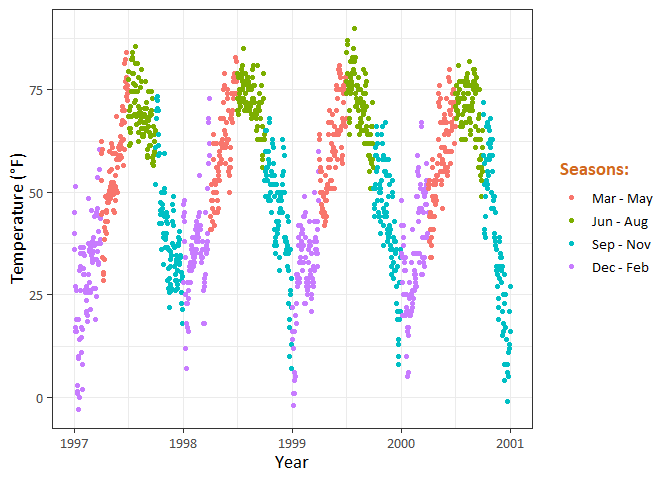<!-- -->

``` r
# Change Background Boxes in the Legend

ggplot(chic, aes(x = date, y = temp, color = factor(season))) +
  geom_point() +
  labs(x = "Year", y = "Temperature (°F)") + 
  
  
  theme(legend.key = element_rect(fill = NA))
```

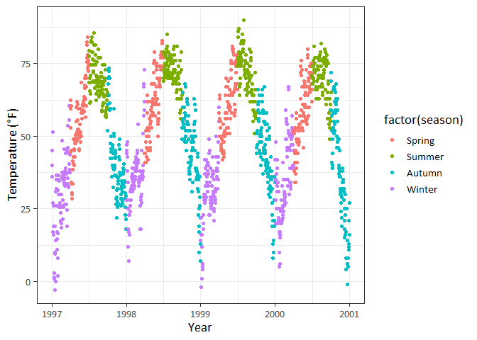<!-- -->

  - `legend.key(fill = ...)`

<!-- end list -->

``` r
# Change Size of Legend Symbols
ggplot(chic, aes(x = date, y = temp, color = factor(season))) +
  geom_point() +
  labs(x = "Year", y = "Temperature (°F)") + 
  theme(legend.key = element_rect(fill = NA),
        legend.title = element_text(color = "chocolate", 
                                    size = 14, face = 2)) +
  scale_color_discrete("Seasons:") +
  
  
  guides(color = guide_legend(override.aes = list(size=3)))
```

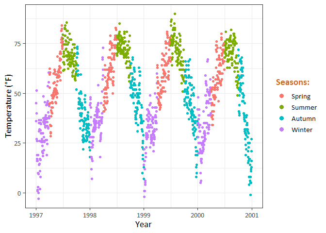<!-- -->

  - Let’s say you have a point layer and you add a rug plot of the same
    data. By default, both the points and the “line” end up in the
    legend like this:

<!-- end list -->

``` r
# leave a layer off the legend
```
